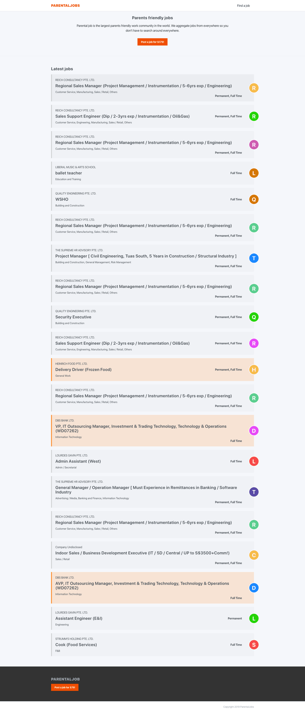
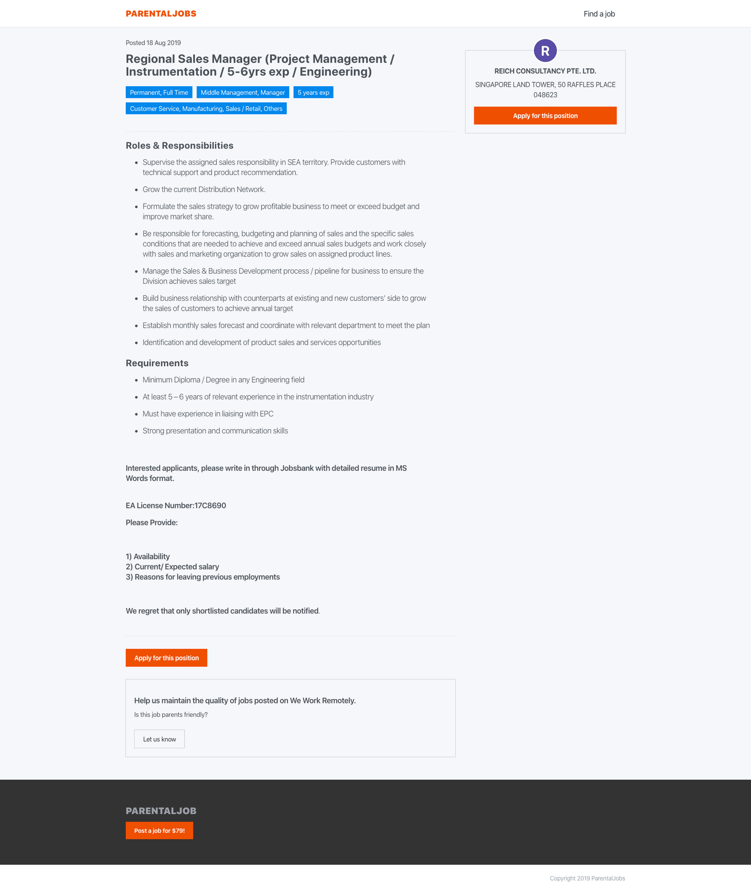
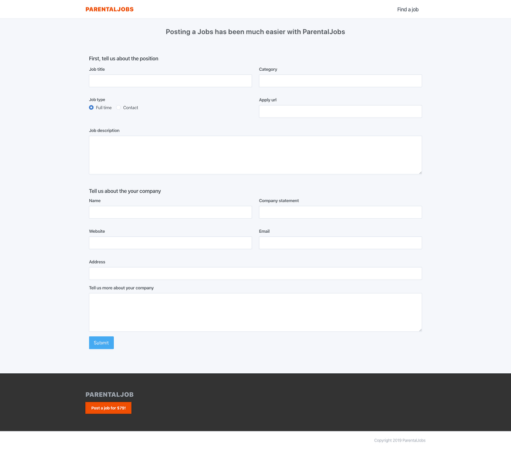

I have added a demo on how I use ReasonMl/ReasonReact with expressJs and mongoDB, you can see how I use Atdgen for sharing types from frontend, reasonML and backend, expressjs/javascirpt types. You can see how I use bs-emotion instead of css, or sass to style the components.

you can see the repo on: [https://github.com/maxlibin/ParentalJobs](https://github.com/maxlibin/ParentalJobs)

This repo also shows how you can crawl some SPA(single page web) with puppeteer and add data to mongodb.

I have added some data data in the dump folder so that you don't have to crawl or add data yourself if you just want to try out.

This repo is fully open source, you can use any ways you want with the sources.  
  
  

