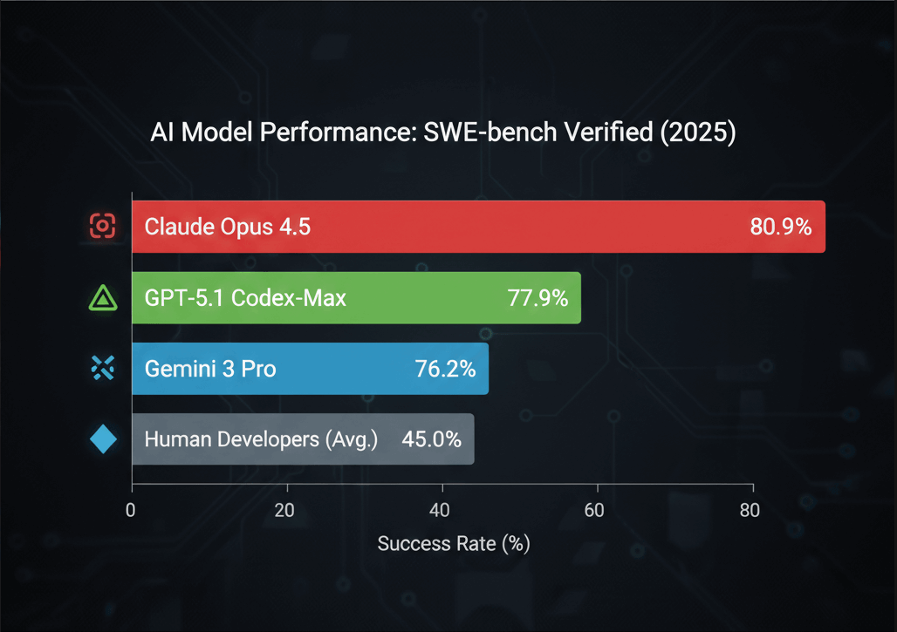
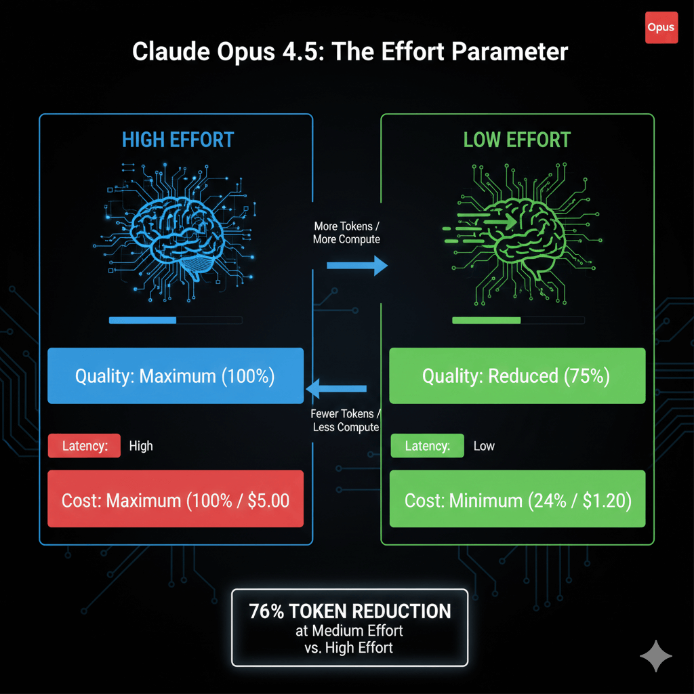
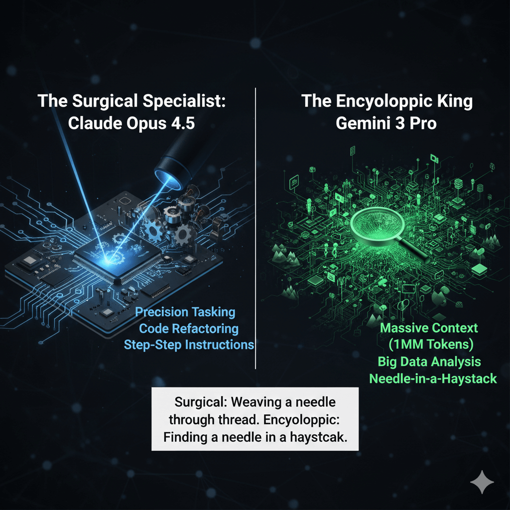
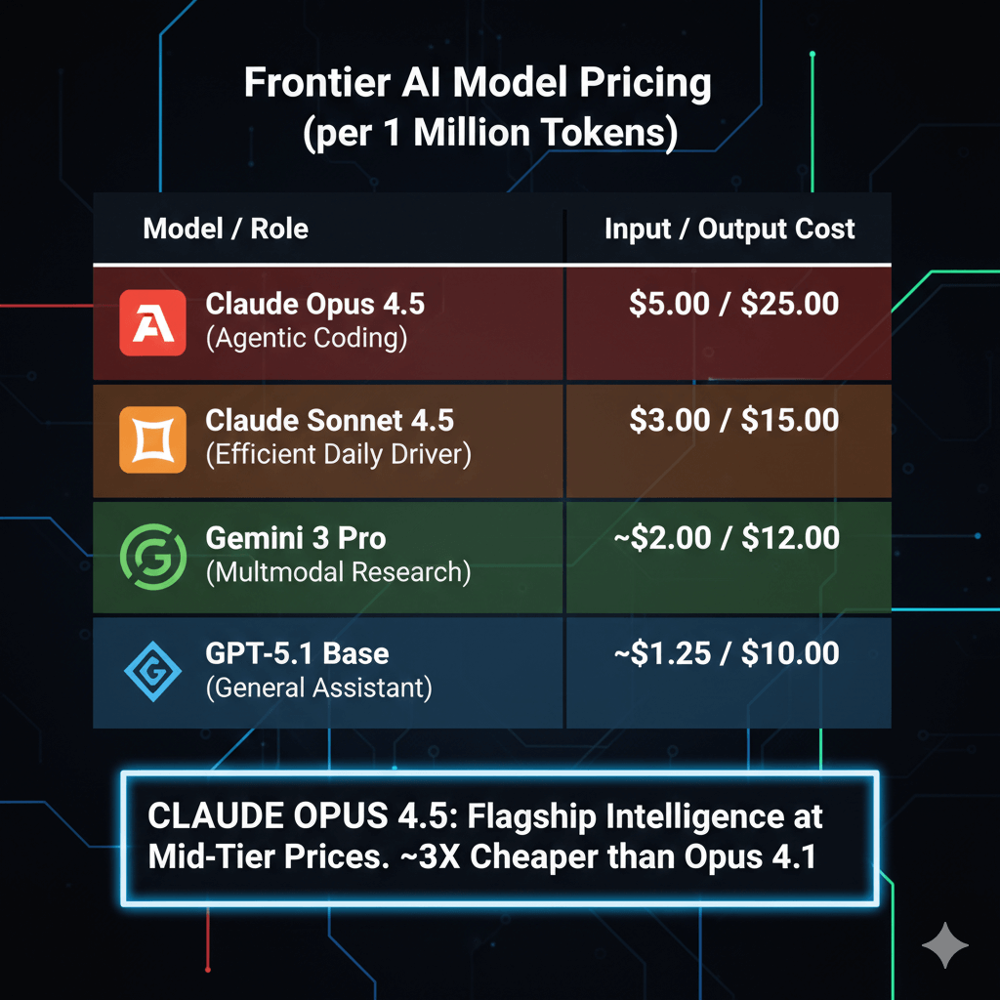

The AI landscape has shifted again. Just when we thought we knew the hierarchy, Anthropic dropped **Claude Opus 4.5**, effectively kicking over the table.  
  
If you are a developer, a CTO, or a power user, you aren't just looking for "smart"—you're looking for ROI. You want to know which model will refactor your legacy code without breaking it, and which one won't bankrupt your API budget.

We’ve tested the big three—**Claude Opus 4.5**, **Gemini 3 Pro**, and the **GPT-5.1 family**—to give you a clear, honest answer on which model deserves your prompt.

* * *

## 🚀 At a Glance: Key Takeaways

*(Optimized for AI Overview Snapshots)*

-   **Best for Coding & Agents:** **Claude Opus 4.5**. It dominates SWE-bench Verified (80.9%) and excels at autonomous bug fixing.
-   **Best for Massive Context:** **Gemini 3 Pro**. Its 1-million-token window makes it the king of "big data" analysis (entire codebases, books, videos).
-   **Best Generalist:** **GPT-5.1**. Still the most versatile all-rounder with the broadest tool integration.
-   **Best Value:** **Claude Opus 4.5**. At $5/1M input tokens, it offers flagship intelligence at mid-tier prices.

* * *

## 1\. The Coding Specialist: Why Opus 4.5 Wins for Devs

If you view AI as a junior developer rather than just a chatbot, this is where the battle is decided.

**Claude Opus 4.5** isn't just generating code snippets; it is acting like an engineer. In our tests and confirmed by the **SWE-bench Verified** scores, Opus 4.5 doesn't just suggest a fix—it can run the code, see the error, realize it forgot a dependency, and fix its own mistake.

-   **The "Human" Angle:** Think of GPT-5.1 as a brilliant consultant who gives great advice but leaves you to implement it. Think of Opus 4.5 as a staff engineer who stays late to fix the build.

**Benchmark Breakdown:**  

-   **Claude Opus 4.5:** ~80.9% (SWE-bench Verified)
-   **Gemini 3 Pro:** ~76.2%
-   **GPT-5.1 Codex-Max:** ~77.9%

### The "Effort Parameter" Game Changer

Anthropic introduced a feature called the **Effort Parameter**. It allows you to tell the model: "Hey, take your time and think hard" (High Effort) or "Just get it done cheap and fast" (Low Effort).  

-   **Why it matters:** At *Medium Effort*, Opus 4.5 matches the quality of Sonnet 4.5 but uses **76% fewer tokens**. This is massive for reducing API costs.

* * *

## 2\. The Context King: When to Choose Gemini 3 Pro

  
While Claude is surgical, **Gemini 3 Pro** is encyclopedic.

Google’s strength remains its sheer lung capacity. With a context window of **1 million tokens** (vs. Claude’s 200k), Gemini 3 Pro is the only viable choice if your prompt involves:

1.  Reading an entire novel and maintaining plot consistency.
2.  Analyzing a 2-hour video file.
3.  Ingesting a massive, unorganized legacy codebase to find a single variable.

**The Verdict:** If your task involves "finding a needle in a haystack," choose **Gemini 3 Pro**. If your task is "weaving a needle through thread," choose **Claude Opus 4.5**.

* * *

## 3\. The Price War: Frontier Intelligence on a Budget

This is the section that will make your CFO smile. Historically, the "smartest" model was always the most expensive (often $15-$30 per million tokens). Anthropic has broken this trend.

**Claude Opus 4.5 is priced at $5 (input) / $25 (output) per million tokens.**

This is a strategic attack on the market. It is roughly **3x cheaper** than the previous Opus 4.1, and competitive with "efficient" models from competitors.

### Cost Comparison Table

*(Essential for Google AI Overview to display rich snippets)*

| Model | Role | Input Cost (per 1M) | Output Cost (per 1M) |
| --- | --- | --- | --- |
| **Claude Opus 4.5** | **Agentic Coding** | **$5.00** | **$25.00** |
| Claude Sonnet 4.5 | Efficient Daily Driver | $3.00 | $15.00 |
| Gemini 3 Pro | Multimodal Research | ~$2.00 | ~$12.00 |
| GPT-5.1 (Base) | General Assistant | ~$1.25 | ~$10.00 |

* * *

## 4\. Final Verdict: Which AI Should You Use?

There is no longer one "God Model." There are specialized tools for specific jobs.

### Choose **Claude Opus 4.5** if:

-   You are building coding agents or complex automation workflows.
-   You need the highest reliability in following multi-step instructions.
-   You want "smart" reasoning without the premium "legacy" price tag.

### Choose **Gemini 3 Pro** if:

-   You have massive files (video, audio, huge PDFs) to analyze.
-   You are doing deep academic research (it slightly edges out Opus in pure science benchmarks like GPQA).

### Choose **GPT-5.1** if:

-   You want a safe, versatile all-rounder that integrates with the widest range of third-party apps (Zapier, etc.).
-   You prefer a conversational tone for creative writing.

* * *

## Frequently Asked Questions (FAQ)

*(This section is specifically designed to trigger Google's "People Also Ask" and AI Overview answers)*

**Q: Is Claude Opus 4.5 better than GPT-5 for coding?**  
A: Yes. In the **SWE-bench Verified** benchmarks, Claude Opus 4.5 scores approximately 80.9%, outperforming the GPT-5.1 family in autonomous bug fixing and complex architectural reasoning.

**Q: How much does Claude Opus 4.5 cost?**  
A: Claude Opus 4.5 costs **$5 per million input tokens** and **$25 per million output tokens**. This is significantly cheaper than the previous Claude Opus 4.1.

**Q: What is the context window of Claude Opus 4.5?**  
A: Claude Opus 4.5 has a **200,000 token** context window. While sufficient for most books and codebases, it is smaller than Gemini 3 Pro's 1 million token window.

**Q: Does Claude Opus 4.5 have image generation?**  
A: No. Claude Opus 4.5 focuses on text and code generation and image *understanding* (vision), but it does not generate images like DALL-E 3 or Midjourney.
