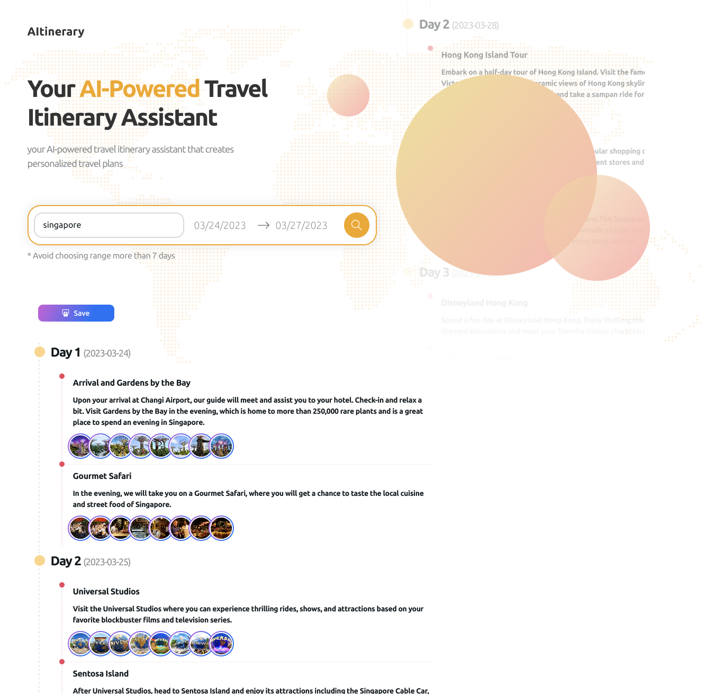

OpenAI's ChatGPT is a powerful language model that can be used to create engaging chatbots, virtual assistants, and content generators. In this blog post, we will explore how to integrate ChatGPT into a Next.js application using the OpenAI Node.js library. We will provide example code to demonstrate how to make API requests and process responses within a simple Next.js app.

**Step 1: Install Required Dependencies**

First, create a new Next.js application using the `create-next-app` command, and navigate to your project directory:

```
npx create-next-app chatgpt-nextjs-example
cd chatgpt-nextjs-example
```

Next, install the OpenAI library:

```
npm install openai
```

Step 2: Create a ChatGPT API Function

Create a new folder called "lib" in the root directory of your Next.js application and add a file called "chatgpt.js" inside it. This file will contain the function for interacting with the ChatGPT API:

```
// lib/chatgpt.js
const { Configuration, OpenAIApi } = require('openai');

const configuration = new Configuration({
  apiKey: process.env.OPENAI_API_KEY,
});

const openai = new OpenAIApi(configuration);

export async function chatGpt(messages) {
  const response = await openai.createCompletion({
    model: 'gpt-3.5-turbo',
    messages: messages,
  });

  return response.choices[0].message.content;
}
```

Step 3: Create a Next.js API Route

Create a new folder called "api" inside the "pages" folder, and add a file called "chatgpt.js" inside it. This file will serve as an API route for your Next.js application to interact with the ChatGPT API function:

```
// pages/api/chatgpt.js
import { chatGpt } from '../../lib/chatgpt';

export default async function handler(req, res) {
  if (req.method === 'POST') {
    const messages = req.body.messages;
    try {
      const chatGptResponse = await chatGpt(messages);
      res.status(200).json({ message: chatGptResponse });
    } catch (error) {
      res.status(500).json({ error: 'Error fetching response from ChatGPT' });
    }
  } else {
    res.status(405).json({ error: 'Method not allowed' });
  }
}
```

Step 4: Create a Simple Chat Interface

Modify the "pages/index.js" file to create a simple chat interface that allows users to interact with ChatGPT:

```
// pages/index.js
import { useState } from 'react';
import axios from 'axios';

export default function Home() {
  const [input, setInput] = useState('');
  const [messages, setMessages] = useState([
    {
      role: 'system',
      content: 'You are a helpful assistant.',
    },
  ]);

  const sendMessage = async () => {
    const newMessage = {
      role: 'user',
      content: input,
    };
    setMessages((prevMessages) => [...prevMessages, newMessage]);

    const response = await axios.post('/api/chatgpt', {
     messages: [...messages, newMessage],
    });

    const assistantMessage = {
      role: 'assistant',
      content: response.data.message,
    };
    setMessages((prevMessages) => [...prevMessages, assistantMessage]);
    setInput('');
  };

  return (
    <div>
      <h1>Chat with ChatGPT</h1>
      <div>
        {messages.map((message, index) => (
          <p key={index} className={message.role}>
            {message.content}
          </p>
        ))}
      </div>
      <input
        type="text"
        value={input}
        onChange={(e) => setInput(e.target.value)}
        placeholder="Type your message..."
      />
      <button onClick={sendMessage}>Send</button>
    </div>
  );
}
```

Step 5: Update Environment Variables

Create a new ".env.local" file in the root of your project and add your OpenAI API key:

```
OPENAI_API_KEY=your_openai_api_key_here
```

Make sure to replace `your_openai_api_key_here` with your actual API key.

Step 6: Run the Application

Start your Next.js development server by running:

```
npm run dev
```

Navigate to [http://localhost:3000](http://localhost:3000) in your browser, and you should see a simple chat interface where you can interact with ChatGPT.

Conclusion:

In this tutorial, we have demonstrated how to integrate ChatGPT into a Next.js application using the OpenAI Node.js library. This example can be extended to create more sophisticated chat interfaces, conversational agents, and other applications that leverage the power of ChatGPT.

This is how I launched a sideproject recently [AI Itinerary](https://aitinerary.ai "AI Itinerary"),  
your AI-powered travel itinerary assistant that creates personalized travel plans.


