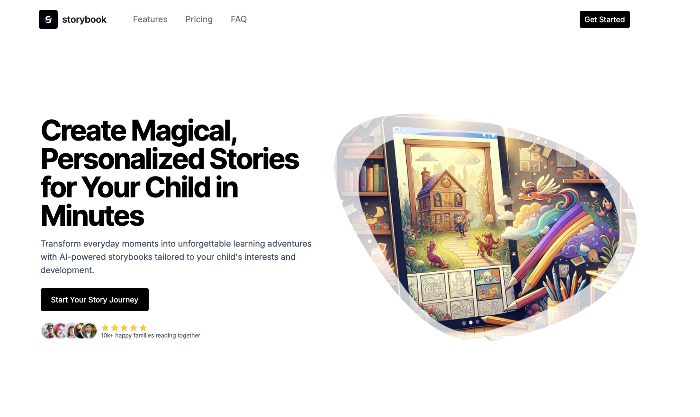

After my initial experience with [Bolt.new](http://bolt.new "Bolt.new"), I was blown away by its capabilities for rapidly developing web applications. But then I stumbled upon [Marblism](https://www.marblism.com/), and I have to say, it’s a game-changer. Marblism takes things to a whole new level.

## What is Marblism?

[Marblism](https://www.marblism.com/ "Marblism") is an AI-powered platform that streamlines the creation of full-stack applications. Unlike traditional development tools, [Marblism](https://www.marblism.com/ "Marblism") lets you describe your app idea in a single prompt and generates a complete, functional codebase—both front-end and back-end components are taken care of.

You can check out a live demo of the app I built with just one prompt here: [Live Demo](https://8099-fl8dvo-workspace.ap-south-1.marblism.com/).

-   The url might not work, it required me to upgrade (pay) to deploy

## Key Features of Marblism

-   **AI-Generated Codebase:** [Marblism](https://www.marblism.com/ "Marblism") utilizes advanced AI to produce a robust and scalable codebase tailored to your application's specific requirements.
-   **Comprehensive Tech Stack:** The platform supports modern technologies like Next.js, Prisma, and PostgreSQL, ensuring high performance and scalability.
-   **Customizable Design System:** Integrated with Ant Design, [Marblism](https://www.marblism.com/ "Marblism") offers a cohesive design system, making the UI development seamless and visually appealing.
-   **Seamless Deployment:** [Marblism](https://www.marblism.com/ "Marblism") offers one-click deployment, allowing you to take your application live without any hassle.

## My Experience with Marblism

I was able to generate a fully functional web application in minutes using just a single prompt. The platform’s AI-driven approach was intuitive, and the generated code was clean, well-structured, and easy to customize. You can see the app I built here: [Live App](https://8099-fl8dvo-workspace.ap-south-1.marblism.com/).

## Conclusion

While [Bolt.new](http://bolt.new "Bolt.new") is fantastic for quick app development, [Marblism](https://www.marblism.com/ "Marblism") truly stands out with its AI-driven code generation and comprehensive features. If you’re looking to accelerate your development process without sacrificing quality, give [Marblism](https://www.marblism.com/ "Marblism") a try—you won’t be disappointed.
