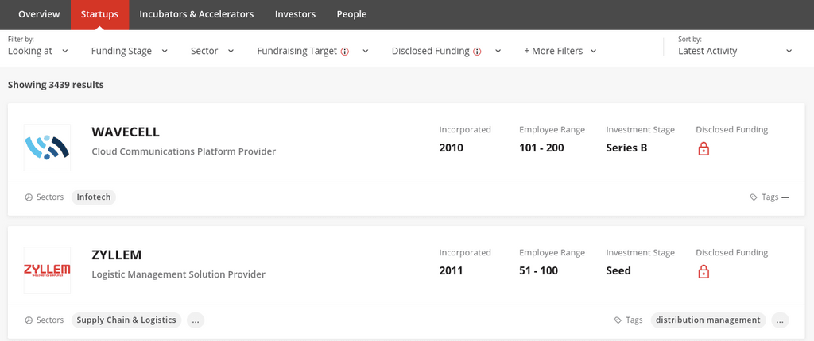
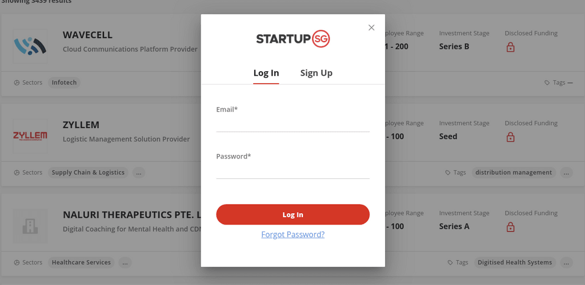
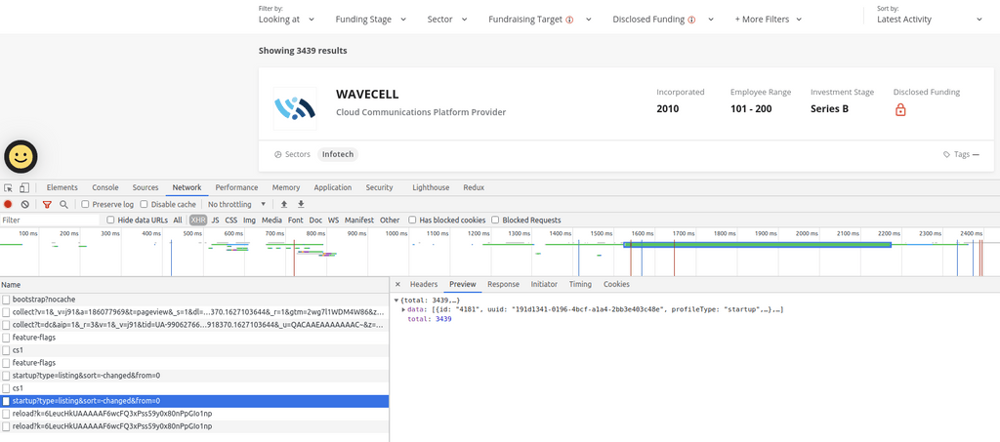
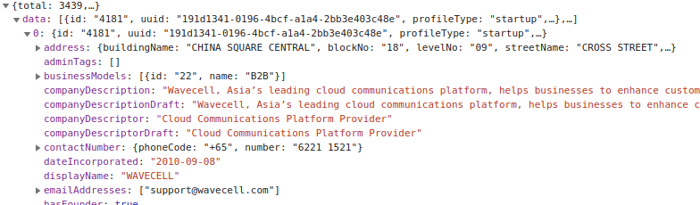
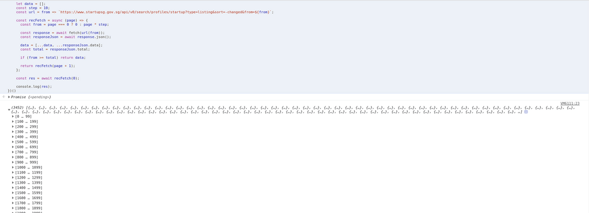
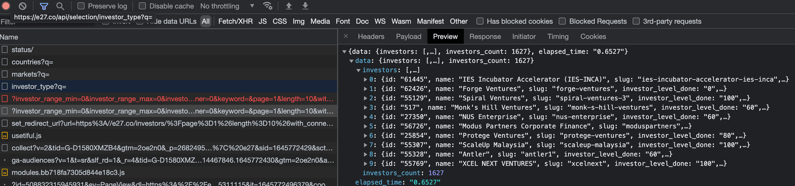
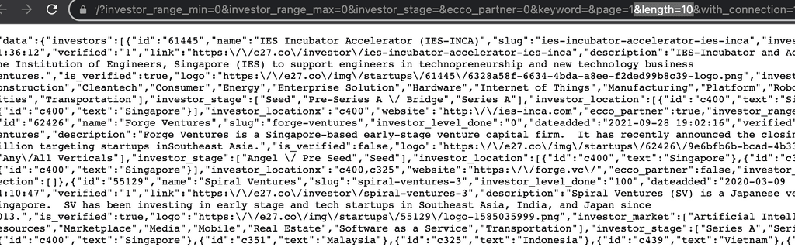

Recently I was reading some article and happened to came across this website [https://www.startupsg.gov.sg](https://www.startupsg.gov.sg), right is a website to showcase startups based in Singapore.

In the website, there are a few directories such as startups, investors and profiles: [https://www.startupsg.gov.sg/directory/startups/](https://www.startupsg.gov.sg/directory/startups/)

  
  
As you can see the infos are protected on UI part, when you click disclosed funding for example, it ask you to register or login, but you might not want to do that, there a another way to quickly read through the data with much more information.

First, open up your browser inspector, I am using Google Chome, if you are not sure how to open the inspector, I have googled for you: [https://support.monday.com/hc/en-us/articles/360002197259-How-to-Open-the-Developer-Console#:~:text=you're%20using.-,Chrome,Console%22%20tab%20in%20that%20window](https://support.monday.com/hc/en-us/articles/360002197259-How-to-Open-the-Developer-Console#:~:text=you're%20using.-,Chrome,Console%22%20tab%20in%20that%20window).

Go to Network Tab, and click XHR, refresh this page, and now you will see all the network requests here, you want to look for a name: "startup?type=listing&sort=-changed&from=0"

  
You can click Preview in the developer inspector to go through each list with lots of detail info, or you can double click to open up this json file, however it will not be easy for your eyes.

  
This will work for other pages like investors, incubators, profiles etc.

I have wrote a simple script which you can get all data at once, use at your own risk

```
(async() => {
let data = [];
const step = 10;
const url = from => `https://www.startupsg.gov.sg/api/v0/search/profiles/startup?type=listing&sort=-changed&from=${from}`;

const recFetch = async (page) => {
  const from = page === 0 ? 0 : page * step;

  const response = await fetch(url(from));
  const responseJson = await response.json();

  data = [...data, ...responseJson.data];
  const total = responseJson.total;

  if (from >= total) return data;

  return recFetch(page + 1);
};

const res = await recFetch(0);

console.log(res);
})()
```

  
If you prefer node solution and insert the data into database such as MongoDB, I have added the script for you at [https://github.com/maxlibin/startupsg](https://github.com/maxlibin/startupsg)

Updated on 25th Feb

Is interesting that you can do the same thing on e27, for example go to: [https://e27.co/investors/?page=1&length=10&with\_connection=1](https://e27.co/investors/?page=1&length=10&with_connection=1)

Open up your console and go to Network tab, you probably see something like this, [https://e27.co/api/fundraise/paging\_n\_filter/?investor\_range\_min=0&investor\_range\_max=0&investor\_stage=&ecco\_partner=0&keyword=&page=1&length=10&with\_connection=1](https://e27.co/api/fundraise/paging_n_filter/?investor_range_min=0&investor_range_max=0&investor_stage=&ecco_partner=0&keyword=&page=1&length=10&with_connection=1)  
this is where the api comes from



Open this tab if you like and modify abit so that you will be able to get the full data, for example change the length of the query length to any number you like, 1000 maybe, it should return 1000 result of investors.


