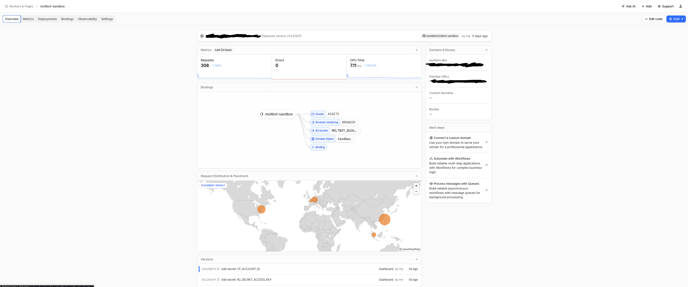
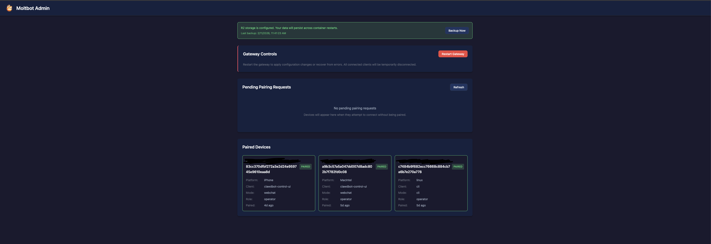
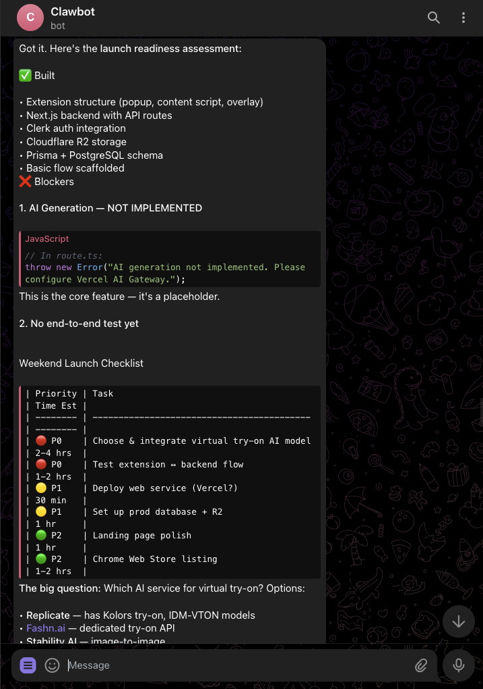

Let’s be real: paying $20/month for every AI tool adds up fast. But what if you could run your own powerful, personalized AI assistant for just **$5 a month**?

That’s exactly what **OpenClaw** (formerly Moltbot) allows you to do. It’s an open-source AI agent that runs entirely on **Cloudflare Workers**. It’s fast, it’s private, and you own the data. Best of all, you don’t need to manage a bulky server—Cloudflare’s edge network handles everything.

Whether you prefer clicking buttons (No-Code) or typing commands (Code), I’ve got you covered. Here is the complete guide to setting it up.

* * *

## 🛠 The Essentials (You need these first)

Before we start, make sure you have:

1.  **A Cloudflare Account:** You’ll need the **Workers Paid Plan** ($5/mo). The free tier won't cut it because the AI container needs a bit more juice (CPU limits).
2.  **An Anthropic API Key:** This is the "brain." Get it from [Anthropic’s console](https://console.anthropic.com/).
3.  **Git Account:** (GitHub or GitLab) to save your worker's code.

* * *

## 🛣️ Choose Your Path

### **Option A: The "Speed Run" (No-Code / Low-Code)**

*Best if you want to get up and running in 5 minutes without touching a terminal.*

**1\. The One-Click Deploy**  
Click the button below to instantly clone the project into your Cloudflare account.



Follow the prompts to connect your GitHub account and click **"Save and Deploy."**  
*(Note: The first deploy might show an error. Relax, that’s normal—we haven’t given it the passwords yet!)*

**2\. Add Your Secrets**  
Go to your [Cloudflare Dashboard](https://dash.cloudflare.com/), find your new Worker (usually named `moltworker`), and navigate to **Settings** → **Variables and Secrets**.


Click **Add** and input these:

-   `ANTHROPIC_API_KEY`: Your key starting with `sk-ant...`.
-   `MOLTBOT_GATEWAY_TOKEN`: A made-up password (long and random!) that you will use to log in.

**3\. Add Storage (Don't let it get amnesia)**  
To make sure your bot remembers chats after a restart:

-   Go to **R2** on the left sidebar and create a bucket named `moltbot-data`.
-   Back in your Worker’s **Settings** → **Variables and Secrets**, scroll to **R2 Bucket Bindings**.
-   Click **Add Binding**. Name the variable `BUCKET` and select your `moltbot-data` bucket.

**4\. Redeploy**  
Go to the **Deployments** tab and click **Redeploy** to save your changes.

* * *

### **Option B: The "Vibe Coder" Route (CLI)**

*Best if you love the terminal and want full control.*

**1\. Clone the Repo**  
Fire up your terminal and grab the code:

```bash
git clone https://github.com/cloudflare/moltworker.git
cd moltworker
npm install
```

**2\. Set Your Secrets**  
Instead of the dashboard, we use `wrangler` to securely upload your keys.

```bash
# 1. The Brain
npx wrangler secret put ANTHROPIC_API_KEY
# (Paste your key when prompted)

# 2. The Gatekeeper (Generate a random token)
openssl rand -hex 32
# Copy this output!
npx wrangler secret put MOLTBOT_GATEWAY_TOKEN
# (Paste the token you just generated)
```

**3\. Deploy**  
Push it live!

```bash
npm run deploy
```

* * *

## 🔒 The Critical Step: Security (Both Paths)

This is where most people get stuck, so read carefully! We need to lock the admin panel (`/_admin`) so random bots don’t hijack your agent. We use **Cloudflare Access** (Zero Trust) for this.

1.  **Enable Access:**
    
    -   Go to your Worker → **Settings** → **Domains & Routes**.
    -   Find the `workers.dev` section and click **Enable Cloudflare Access**.
    -   Follow the prompts to create a "Team" if you haven't already.
2.  **Get the Keys:**  
    Once enabled, you will see an **Audience Tag (AUD)** on that screen. **COPY IT.**  
    You also need your **Team Domain** (e.g., `my-team.cloudflareaccess.com`), found in the Zero Trust Dashboard (`Settings` → `Custom Pages`).
    
3.  **Update the Worker:**
    
    -   **No-Code Users:** Go back to **Settings** → **Variables** and add two new secrets: `CF_ACCESS_AUD` and `CF_ACCESS_TEAM_DOMAIN`.
    -   **CLI Users:** Run:
        
        ```bash
        npx wrangler secret put CF_ACCESS_AUD
        npx wrangler secret put CF_ACCESS_TEAM_DOMAIN
        ```
        
4.  **Final Redeploy:** Hit deploy one last time to lock everything down.
    

* * *

## 🚀 Launch Time

You’re done! Here is how to access your new AI employee.

1.  **Construct your URL:**  
    It will look like this:  
    `https://your-worker-name.your-subdomain.workers.dev/?token=YOUR_GATEWAY_TOKEN`  
    *(Replace `YOUR_GATEWAY_TOKEN` with that long random password you created earlier).*
    
2.  **Log In:**  
    You’ll be hit with a Cloudflare Access screen. Enter your email, get the code, and you’re in.
    
3.  **Pair Devices:**  
      
    Want to connect a terminal or a different browser? Go to `https://.../workers.dev/_admin` to approve new devices.
    

### 💡 Pro Tips for a Smooth Ride

-   **Cold Starts:** If the page hangs for ~30 seconds the first time, don't panic. The container is just waking up.
-   **Cost Control:** This runs on the $5 Workers plan, but R2 storage and AI usage might add pennies. It’s still cheaper than a $20 subscription!
-   **Custom Domain:** Use the "Triggers" tab in Cloudflare to connect `ai.yourdomain.com` for a more professional feel.



Happy building! 🛠️
