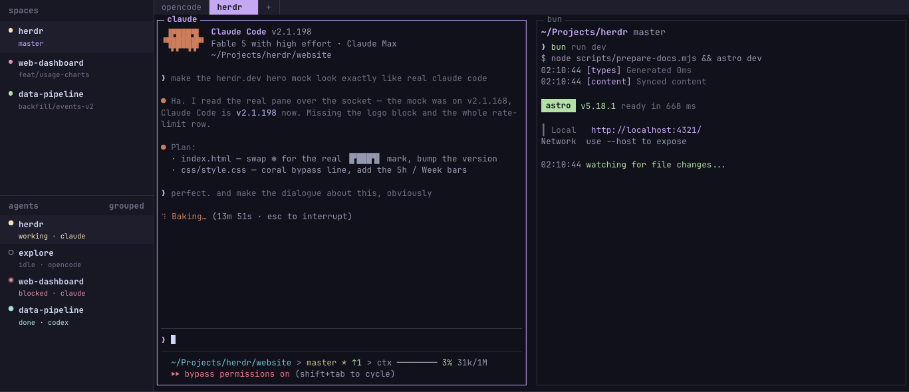

I’ve been a [tmux user](https://github.com/tmux/tmux?utm_source=chatgpt.com) for quite a while.

More specifically, I normally use tmux together with [Oh My Tmux](https://github.com/gpakosz/.tmux?utm_source=chatgpt.com), and honestly, it works perfectly fine. It is fast, stable, lightweight, and does almost everything I need from a terminal multiplexer.

But recently, I started using [Herdr](https://github.com/herdrdev/herdr?utm_source=chatgpt.com) instead.

And strangely enough, I don’t really have a long list of reasons why.

Herdr doesn’t have some magical feature that suddenly makes tmux obsolete. For most of the normal things I do — splitting terminals, keeping sessions alive, running multiple processes, switching between panes — tmux already does the job extremely well.

Still, I find myself enjoying Herdr more.

## My Terminal Workflow Has Changed

The biggest reason is probably not Herdr itself.

It’s AI coding agents.

These days I rarely have just one terminal open with an editor and a development server.

A typical workspace might look more like this:

-   [Claude Code](https://github.com/anthropics/claude-code?utm_source=chatgpt.com) working on one problem
-   [Pi](https://github.com/badlogic/pi-mono?utm_source=chatgpt.com) working on another task
-   Another coding agent investigating something
-   A development server running
-   Logs running somewhere else
-   Me jumping between all of them

Technically, I can do exactly the same thing with tmux.

And I did.

The difference with Herdr is that it feels more natural for this kind of workflow.

When I have multiple AI coding agents running, I can quickly look at the workspace and understand what is happening in each panel.

I can see which agent is working, which one is waiting, and which terminal I should probably look at next.

That sounds like a small thing.

But once you start running several coding agents at the same time, it becomes surprisingly useful.

## tmux Still Does the Job

I don’t want this to sound like one of those:

> “tmux is dead, everyone should move to Herdr.”

Not at all.

tmux is still excellent.

In fact, if I compare Herdr with my old Oh My Tmux setup, there really isn’t a huge feature gap for normal terminal usage.

tmux is mature, extremely efficient, customizable, and has been around forever.

If your workflow is something like:

```text
Editor
Server
Logs
Shell
```

I’m not sure Herdr gives you a strong reason to switch.

But my workflow increasingly looks like:

```text
Claude Code
Pi
Codex
Another Pi session
Server
Logs
```

And that changes what I want from a terminal multiplexer.

I’m no longer only managing terminals.

I’m managing **agents**.

## Herdr Makes the Workspace Easier to Read

This is probably the thing I appreciate most.

With tmux, a pane is basically a pane.

I know what is running inside because I opened it, named the window, or remember what I was doing there.

With Herdr, the workspace feels a little more aware of what is happening.

When several AI coding agents are running simultaneously, it becomes much easier to glance at the screen and understand:

**this agent is working**

**this one is waiting**

**this one needs my attention**

Instead of opening each terminal and trying to remember what was happening.

It’s not revolutionary.

But it removes a little bit of mental overhead.

And lately I’ve noticed that a lot of my developer tooling decisions come down to exactly that.

Not necessarily huge new features.

Just fewer things I have to keep in my head.

## So Far, It Fits My Workflow

That’s really the main reason I’m still using Herdr.

Not because it completely replaces everything tmux can do better.

Not because tmux suddenly became outdated.

And definitely not because Herdr has some massive feature advantage.

It simply fits the way I’m coding right now.

AI coding has made my terminal much busier than it used to be. Instead of one developer working inside several terminals, I now feel like I’m supervising several developers working inside several terminals.

Claude Code is doing something.

Pi is doing something else.

Maybe [Codex](https://github.com/openai/codex?utm_source=chatgpt.com) is experimenting with another approach.

And I’m moving between them, reviewing the results and deciding what happens next.

Herdr makes that environment a little easier to understand.

For now, that is enough of a reason for me to keep using it.

I may eventually go back to tmux. I still like tmux, and I still think it is one of the best terminal tools ever made.

But so far, **Herdr works surprisingly well with my AI coding workflow**.

And sometimes that’s all a tool needs to do.

## Tools Mentioned

-   [Herdr on GitHub](https://github.com/herdrdev/herdr?utm_source=chatgpt.com)
-   [tmux on GitHub](https://github.com/tmux/tmux?utm_source=chatgpt.com)
-   [Oh My Tmux on GitHub](https://github.com/gpakosz/.tmux?utm_source=chatgpt.com)
-   [Claude Code on GitHub](https://github.com/anthropics/claude-code?utm_source=chatgpt.com)
-   [Pi Coding Agent on GitHub](https://github.com/badlogic/pi-mono?utm_source=chatgpt.com)
-   [OpenAI Codex on GitHub](https://github.com/openai/codex?utm_source=chatgpt.com)
