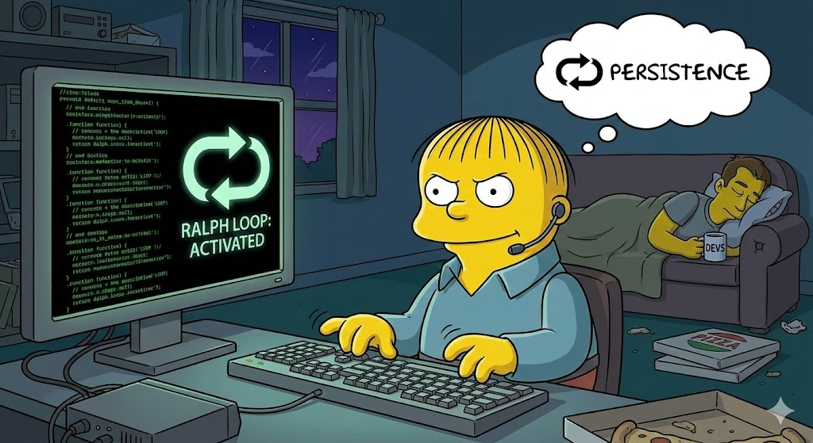

If you’ve been lurking around the AI engineering watercoolers (aka X or Reddit) lately, you might have heard developers whispering about "**Ralph Wiggum**."

No, they aren’t quoting *The Simpsons* ("My cat's breath smells like cat food"). They are talking about a brute-force AI coding technique that is quietly changing how we interact with autonomous agents.

Here is the full download on what the heck Ralph is, how to set him up, why he works, and—crucially—how to keep him from bankrupting you.

* * *

### What the \* is Ralph Wiggum?

In the simplest terms, **Ralph Wiggum is a loop.**

Specifically, it is a technique (and now a plugin for tools like Claude Code) where you force an AI agent to run in a continuous, self-correcting cycle.

Normally, when you ask an AI to "build a To-Do app," it gives it one best shot and then stops. If it made a mistake? Too bad. Ralph is different. Ralph is the AI equivalent of a developer who refuses to go home until the tests pass.

The name comes from the idea that Ralph (the character) keeps trying things even when he fails. In code terms: "Ralph is a bash loop." You feed the agent a prompt, it tries to write code, and instead of letting it finish, a script intercepts the exit command and says, *"Not done yet, try again."*

* * *

### How do I use it?

Previously, this was a hacky bash script you had to write yourself. Now, thanks to the community (and the *Awesome Claude* list), it's a plugin you can install directly into Claude Code.

**1\. Install the Plugin**  
Open your terminal and tell Claude to grab the official "Ralph Loop" plugin:

```bash
/plugin install ralph-loop@claude-plugins-official
```

**2\. Set the Trap (Start a Loop)**  
You don't just say "fix the code." You need to give Ralph a clear exit criterion—a "completion promise."  
Run this command to start a loop:

```bash
/ralph-loop:ralph-loop "Build a Hello World API" --completion-promise "DONE" --max-iterations 10
```

**3\. Watch the Magic (or Horror)**

-   **The Loop:** The AI writes the code.
-   **The Check:** It tries to exit.
-   **The Block:** Ralph checks if the output contains the word "DONE". If not (or if tests fail), it **blocks the exit** and feeds the error logs back into the AI.
-   **The Fix:** The AI reads the error, thinks "Oh, I see what I did wrong," and tries again.
-   **The Success:** This repeats until the criteria are met and the AI finally shouts "DONE".

* * *

### Why does it work?

It works because **iteration beats genius.**

Most LLMs (Large Language Models) are smart, but they are also forgetful and prone to small, stupid errors. In a single-shot attempt, one typo breaks the whole app.

But when you put that same model in a Ralph loop, it gains **memory through the file system**.

-   **Attempt 1:** It writes a broken function.
-   **Attempt 2:** It sees the file it just wrote, sees the error log saying "Syntax Error on line 5," and fixes it.

It turns the AI's "hallucinations" into "drafts." It creates a feedback loop that mimics how human developers actually work: write, run, crash, fix, repeat.

* * *

### Does it burn your tokens? (And how to fix it)

**Oh, absolutely.** 🔥

Ralph is not efficient; Ralph is *persistent*. If a normal request costs you $0.10, Ralph might run that request 20 times to get it right, costing you $2.00. You are trading money for your own time.

**How to Reduce the Burn:**  
If you want to use Ralph without waking up to a scary credit card bill, follow these rules:

1.  **Don't Ask Ralph to "Design":**  
    If you ask vague questions like "Make the UI look better," Ralph will loop forever because "better" isn't a compilation error he can fix.
    
    -   *Bad:* "Fix the bugs."
    -   *Good:* "Run `npm test`. Fix errors until all tests pass. Output DONE."
2.  **Give Him a Seatbelt (`--max-iterations`):**  
    Always set a hard limit. If Ralph hasn't fixed the bug in 15 tries, he’s probably stuck in a hallucination loop. Kill the process and save your tokens.
    
    -   *Tip:* Start with `--max-iterations 5` for small tasks.
3.  **Feed Him Less Context:**  
    Ralph reads files every time he loops. If you feed him your entire 50MB repo for a small CSS change, you are paying for him to re-read that 50MB twenty times. Use `.claudignore` or specific context flags to limit what he sees.
    
4.  **The "Linter First" Rule:**  
    Don't make Ralph fix missing semicolons. Run a linter (like Prettier or ESLint) *before* you start the loop. Don't pay $5 in AI credits to fix whitespace errors.
    

* * *

### The Verdict

Ralph Wiggum is a powerful tool for the lazy (smart) developer. It’s perfect for **grunt work** (migrations), **test fixing**, and **greenfield projects**. Just remember: he works best when you give him a very specific target to hit.

**Relevant Video:**  
If you want to see exactly how this "loop" methodology turns average AI agents into powerful autonomous workers, check out this deep dive:  
[Ralph Wiggum under the hood: Coding Agent Power Tools](https://www.youtube.com/watch?v=fOPvAPdqgPo)
