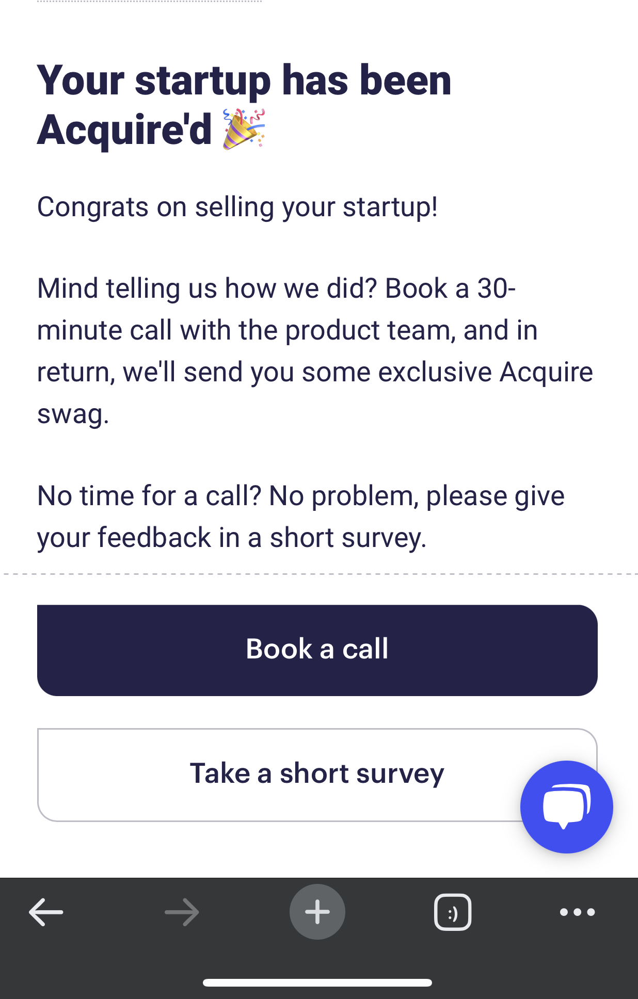

  
I'll be sharing the story of my entrepreneurial journey – from ideating and developing an AI-driven itinerary app to eventually getting it acquired. It's a tale of passion, persistence, and learning valuable lessons along the way.

**The Idea and Market Research:**  
I started by identifying a problem faced by travelers: the time-consuming and often tedious task of planning trips. With the rise of AI and machine learning, I saw an opportunity to create a unique solution – an AI-powered itinerary generator that simplifies trip planning.

**Developing the MVP:**  
Once I had a clear vision, I built a minimum viable product (MVP) to test the concept. Leveraging the power of OpenAI's ChatGPT, the app generates personalized itineraries based on user preferences, creating a seamless and enjoyable experience.

if you are interested in learning some code, [check out here](https://maxlibin.com/create-a-nextjs-app-with-chatgpt-api "check out here")

**Launching and Monetizing:**  
After launching the MVP, I started getting valuable feedback from users. The monetization strategy was simple: users paid $1 to share their AI-generated itineraries with friends or family. As the app gained traction, I continued refining its features and improving the user experience.

**Gathering and Implementing User Feedback:**  
User feedback played a crucial role in the app's evolution. I actively sought input from users and implemented their suggestions to enhance the product, including features like location auto-suggestions, budget filters, and partnerships with local businesses.

**The Acquisition Process:**  
As the app grew, I decided to explore the possibility of selling it to focus on another project. I listed the app on MicroAcquire, a marketplace for buying and selling startups. After crafting a compelling listing, I engaged with interested buyers and started discussions about the app's potential, features, and current performance.

**Closing the Deal:**  
I received multiple offers and ultimately selected a buyer who shared my vision for the app's future. We negotiated the terms and completed the acquisition process, marking the end of my journey with the AI itinerary app.

**Conclusion:**  
Building and selling an AI product has been a rewarding and educational experience. I've learned about the importance of user feedback, refining monetization strategies, and the power of perseverance. As I embark on my next project, I'll carry these lessons forward, always striving to innovate and create solutions that make a difference.

Happy travels!
