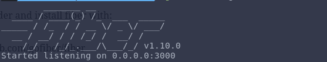
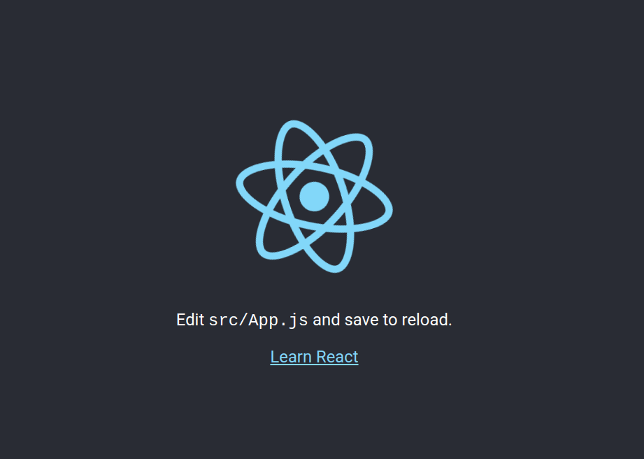

This is a guide on how to setup a web app with Go/GoLang, React and MongoDB

Assuming you have already installed [Go language](https://go.dev/dl/ "Go language") and [NodeJS](https://nodejs.org/en/ "NodeJS") in you machine. If not please install with the links above.

A the time of writing I am using go version go1.14.2 darwin/amd64, and Nodejs v13.8.0

So the first thing we want to do is to set up a server first with Go, the easiest framework that I found is [fiber](https://gofiber.io/ "fiber") which has very similar syntax like ExpressJs, personally felt easier for people who comes from NodeJs world.

This is what they said on their main doc:

Fiber is an [Express](https://github.com/expressjs/express "Express") inspired web framework build on top of [Fasthttp](https://github.com/valyala/fasthttp "Fasthttp"), the fastest HTTP engine for Go. Designed to ease things up for fast development with zero memory allocation and performance in mind.

Lets create a project folder:

```
mkdir fullstackgoreact
```

go into the folder and install fiber with:

```
go get -u github.com/gofiber/fiber
```

and create a main go file,

```
touch main.go
```

and add these code into main.go file

```
package main

import "github.com/gofiber/fiber"

func main() {
  app := fiber.New()

  app.Static("/", "./public")

  app.Listen(3000)
}
```

now when you run

```
go run main.go
```

you should see something like my screenshot  


When you open localhost:3000 on your browser but you see a blank page with Not Found since there is no front-end static files yet.

Lets setup a frontend project with Create-React-App

on the same folder as main.go, close go application by pressing `control C`  
with same terminal enter:

```
npx create-react-app frontend
npx allows you to run npm code without installing this package.
```

Now run

```
cd frontend && yarn build 
This will build react app, the built folder is on /frontend/build
```

go back to previous folder with

```
cd ../ && vim main.go
modify the static folder and by changing ./public to ./frontend/build save and exit.
```

run

```
go run main.go
```

Open up browser and check localhost:3000 again, and there you go, you have your first react go application.  
You should see what I see in the screenshot  
  
I will cover connecting Go and React with MongoDB on next post.
