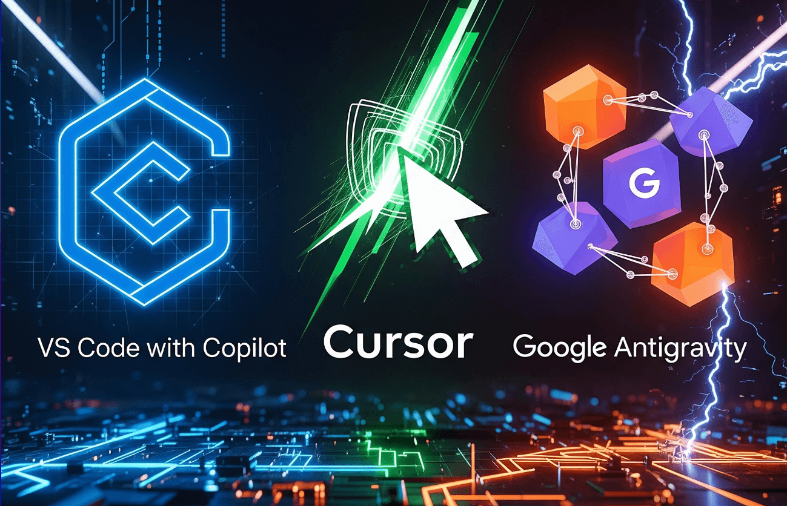

  
The development world is rapidly evolving past simple line completion. The choice of an Integrated Development Environment (IDE) is no longer solely about feature sets. Instead, adopting an IDE today is about choosing a strategic philosophy: augmentation, assistance, or full agentic delegation.

We are analyzing the three platforms leading this revolution: the ubiquitous Visual Studio Code (VS Code) paired with GitHub Copilot, the AI-native Cursor, and Google’s ambitious, agent-first platform, Antigravity.

## Key Takeaways: The Definitive Verdict at a Glance

The current AI IDE competition centers on which platform can most reliably integrate large language models (LLMs) into the daily workflow. This includes addressing critical concerns like cost, stability, and enterprise compliance.

-   **VS Code with Copilot** maintains its dominance through stability and ecosystem breadth.
-   **Cursor** offers the highest immediate velocity through deep AI integration.
-   **Google Antigravity** pushes the boundary into true autonomous delegation.

Comparative Summary Table: AI IDE Philosophies

<table><tbody><tr><td><strong>Platform</strong></td><td><strong>Core Philosophy</strong></td><td><strong>Key Advantage</strong></td><td><strong>Current Drawback</strong></td><td><strong>Target User</strong></td></tr><tr><td>VS Code + Copilot</td><td>AI-Augmented IDE</td><td>Extensive Extensibility &amp; Enterprise Governance</td><td>Reliance on Extensions for AI depth</td><td>Established Teams, Security-Focused</td></tr><tr><td>Cursor</td><td>AI-Native Co-Pilot</td><td>Seamless AI Integration (Composer/Chat) &amp; Multi-Model Choice</td><td>Subscription + API Costs, Smaller Ecosystem</td><td>Startup/Scale-up, Rapid Prototyping</td></tr><tr><td>Google Antigravity</td><td>Agentic Platform</td><td>Autonomous Cross-Surface Agents &amp; Superior Benchmarks</td><td>Stability, Immediate Quota Limits, Unproven Pricing</td><td>AI Researchers, Forward-Looking Architects</td></tr></tbody></table>

## Choosing Your Co-Pilot: Three Distinct AI Paradigms

The three platforms reviewed define three distinct relationships between the developer and artificial intelligence. Understanding these core philosophies is essential for strategic adoption.

### Paradigm 1: The Standard – VS Code and the AI Add-on

Visual Studio Code, released by Microsoft in 2015, established itself as the standard code editor, built on the stable Electron framework.1 Its enduring success is underpinned by its reliability, robust performance, and the massive, active extension marketplace it supports.1

In this paradigm, the developer’s workflow is augmented by AI. The primary tool is GitHub Copilot, which operates as an extension or add-on.1 The Pro plan typically costs $10 USD per month.1

The platform’s architecture prioritizes the core editing experience, ensuring that the AI assistance layer complements, rather than dictates, the established toolchain. This approach is highly valued in enterprise environments where maintaining a mature toolchain and minimizing training overhead are critical priorities.4

The risk profile is low because the AI is an optimization, not a disruptive architectural change, allowing for predictable performance and seamless integration with existing Microsoft infrastructure.4

### Paradigm 2: The Co-Pilot – Cursor and AI-Native Velocity

Cursor, launched in 2023, represents the current pinnacle of the "AI Assistance" era.1 It is a proprietary, AI-powered IDE built as a fork of VS Code, allowing it to leverage familiarity while integrating AI deeply into the coding environment.1

The workflow centers on the Composer and inline chat features, positioning the AI as a hyper-efficient, ever-present pair programmer.5 Cursor’s architecture is AI-first, meaning its core design is optimized for tasks like advanced codebase queries, rapid debugging, and smart rewrites.1 This makes the process of comprehending large codebases significantly faster.1

This deep integration translates directly into increased velocity for specific use cases. Analysis suggests Cursor can deliver 40–60% faster prototyping speeds for certain workflows.4 For startups and scale-ups focused on maximizing agility and rapid feature iteration, Cursor’s emphasis on maximum AI capability offers a substantial competitive advantage.4

### Paradigm 3: The Architect – Antigravity and the Agent-First Future

Google Antigravity signals a shift toward the "Agent-First" era.7 Antigravity is an agentic development platform, also based on a VS Code fork, allowing developers to immediately recognize the interface.9

The fundamental change is the developer's role, which moves from being a bricklayer to an architect who delegates high-level "missions" to autonomous agents.7 These agents are powered by models like Gemini 3 and possess cross-surface control.8

They operate across the Editor (writing code), the Terminal (installing dependencies or running commands via client and server-side bash tools), and the Browser (previewing and verifying application changes).8

The core feature is the Agent Manager View, or "mission control".7 Here, tasks are delegated, and agents execute the plan autonomously, communicating their progress and results through "Artifacts".7 This capability to execute and verify complex tasks defines a new paradigm, allowing a developer to manage multiple agents working in parallel on distinct parts of a project.7

## Feature Face-Off: Autonomy, Context, and Control

Technical superiority is measured by how deeply the AI can integrate with the development lifecycle and how much verifiable context it can maintain.

### Cross-Surface Control: Terminal, Browser, and the Agent’s Reach

The integrated capability for autonomous execution across the terminal and browser provides Antigravity with a profound architectural advantage.10 Agents can perform closed-loop verification: they can write code, run necessary commands like installing packages, and then open the application in a browser to confirm visual or functional changes.7

This ability to integrate automated *testing* and *verification* directly into the code generation workflow is a massive step beyond traditional AI assistants, which typically stop at generating code blocks.

Neither Cursor nor Copilot natively offers this full-stack, verifiable automation.12 The cross-surface control in Antigravity reduces the cognitive load on the developer, moving the focus away from minute syntax verification and toward defining and reviewing high-level requirements and architectural fit.

### Trust and Verification: The Power of Artifacts

For organizations concerned with protecting proprietary algorithms and sensitive Intellectual Property (IP), verifiable documentation of AI-generated code is essential. Antigravity uniquely addresses this by making Artifact Generation a mandatory output of the agent workflow.7

These artifacts provide a clear, detailed trail of the agent’s actions, reasoning, and verification results.12

In comparison, GitHub Copilot Enterprise offers established IP indemnity and robust enterprise audit logs, making it the industry standard for strict security compliance, such as SOC 2.12 Cursor, however, offers minimal documentation, usually restricted to usage logs.12 The Antigravity artifact system has the potential to become the gold standard for auditability, providing transparency into the AI's "black box." This detailed trail of verifiable documentation is crucial for IP audits and regulated industries.12

### Model Stability and Flexibility

Cursor demonstrates a clear advantage in model agility and reliability. It supports multiple, high-performing LLMs—including Gemini 3 Pro and various Claude models—and allows users to switch between them.12

This multi-model strategy is vital for operational continuity, as flagship models often experience high demand, leading to overload messages and service degradation, as was observed shortly after the launch of Gemini 3 Pro.13

Cursor further manages this risk with its 'Auto' mode, which detects degraded performance in one model and automatically switches to the highest-reliability alternative.14 Antigravity, while leveraging the power of Gemini 3, ties itself closely to the Google ecosystem. This deep vertical integration with Gemini 3 means the platform is vulnerable to a single point of failure tied to the model’s performance and service availability.15 Cursor’s flexibility offers a superior hedging strategy against LLM service instability.

## Real Talk: Experience, Performance, and Stability

The utility of an IDE is ultimately judged by its daily usability. Comparisons here reveal a gap between ambitious potential and present-day maturity.

### The Speed Test: Benchmarks vs. Reality

Antigravity reports impressive internal performance benchmarks, showcasing the raw capability of its agentic architecture. Data suggests Antigravity can achieve 40% faster codebase query resolution and significantly higher accuracy (94%) on complex refactoring tasks compared to Cursor’s 78%.16

Furthermore, the time required to complete a complex feature implementation was measured at 42 seconds in Antigravity versus 68 seconds in Cursor.16

These figures highlight a dramatic technical leap. However, theoretical peak performance is often irrelevant if the tool is unreliable. While VS Code is inherently lightweight 1, and Cursor adds only minor resource overhead (e.g., 1.5 GB of RAM versus 1.2 GB for VS Code + Copilot) , Antigravity's superior speed is currently negated by severe usage limitations. Developers frequently report hitting immediate quota limits or seeing agents stall halfway through complex tasks.5

In production environments today, Cursor’s reliable, stable performance currently delivers a higher realized ROI than Antigravity’s restricted, high-speed potential.

### UI Polish vs. Ambitious Fragility

Cursor is generally described by developers as a fast, stable, and well-designed environment.5 Antigravity, by contrast, is deemed "more ambitious and more fragile".5

The most significant barrier to Antigravity adoption is its current instability and poor usage management. Developer feedback indicates frequent login loops and, critically, immediate credit exhaustion after minutes of use, with no clear way to purchase more access.15

This operational immaturity limits Antigravity’s usefulness to non-critical, experimental projects, creating distrust among power users who require reliable, consistent tooling.

### Extension Ecosystem and Toolchain Integration

Both Cursor and Antigravity, as forks of VS Code, generally maintain compatibility with the vast majority of the VS Code extension ecosystem.1 VS Code’s extension marketplace remains an unmatched repository of community support and customization options.1

However, the forks inevitably create limitations where custom extensions rely on core VS Code APIs. Tools for specialized workflow management, such as Graphite for stacked pull requests (PRs), may have robust native extensions for VS Code but not yet for Cursor or Antigravity.1

This forces developers using complex, customized toolchains to choose between the cutting-edge AI features of the forks and the full, guaranteed compatibility of their established VS Code environment. Any time an AI IDE deviates to support agentic or composer workflows, it risks breaking compatibility with highly customized developer tooling.

## Pricing, Privacy, and Enterprise Viability

The financial model of AI IDEs is complex, involving subscriptions and variable API costs based on token consumption—a necessary consideration for any team seeking predictable budgets.

***(Image Placeholder: Insert a graphic comparing the predictable vs. variable pricing models here)***

**Cost Model Comparison: Fixed vs. Variable AI Spend**

<table><tbody><tr><td><strong>Platform</strong></td><td><strong>Base Cost (Monthly)</strong></td><td><strong>Usage Model</strong></td><td><strong>Power User Cost Estimate</strong></td></tr><tr><td>VS Code + Copilot (Pro)</td><td>$10 USD 2</td><td>Fixed fee + 300 premium requests 3</td><td>$10 USD (Highly predictable) 2</td></tr><tr><td>Cursor (Pro)</td><td>$20 USD 12</td><td>Subscription + variable API token usage 12</td><td>$60 - $200+ USD</td></tr><tr><td>Google Antigravity</td><td>Free (Public Preview) 12</td><td>Highly restrictive/immediate credit quota</td><td>Functionally unreliable/Prohibitive</td></tr></tbody></table>

### Predictable Costs: Cursor and Copilot Pricing Models

GitHub Copilot Pro offers maximum cost predictability, priced at a fixed $10 per month.2 This predictable expense makes it highly manageable for budgets.

Cursor employs a hybrid model. The Pro plan starts at $20 per month but includes only a limited amount ($20) of API agent usage.12 Since complex agentic tasks are token-intensive, the final bill scales rapidly. Power users leveraging the full automation capabilities of Cursor can expect total monthly costs to reach $100 to $200 or more, based on usage data, or approximately $70 on top of the base plan for heavy usage . The choice here is stark: pay a low, fixed fee for Copilot, or pay a variable, potentially high fee for Cursor’s maximum AI capability.

### The Opaque Credit Wall: Antigravity’s Monetization Mystery

Antigravity is currently provided for free in a public preview.12 However, this "free" access is functionally unreliable. Developers quickly exhaust their allocated credits, sometimes within minutes of use (often reporting the quota is hit after about 20 minutes) . Critically, there is no option or visible mechanism within the interface to purchase additional usage.

This opaque and restrictive pricing strategy is the greatest threat to Antigravity’s long-term viability. It discourages the high usage necessary for power users and enterprises to properly test the platform in production, actively fostering instability and generating distrust. Google must urgently introduce a clear, scalable payment structure to demonstrate long-term commitment and compete with the established, predictable models offered by its rivals.

### Compliance and Intellectual Property (IP) Protection

Enterprise adoption in regulated sectors mandates compliance standards, such as SOC 2, and robust IP protection. GitHub Copilot Enterprise leads the market here, offering established audit logs, SOC 2 compliance, and contractual IP indemnity, making it the default choice for financial services and healthcare providers.12

Cursor currently lacks SOC 2 compliance.12 While Antigravity’s youth prevents it from securing immediate compliance verification, its use of mandatory artifacts offers a verifiable documentation trail crucial for IP audits.12 However, the platform's current status as a public preview necessitates caution. Until Google fully clarifies data retention and privacy policies for the large models powering Antigravity, using it with highly proprietary code involves a prohibitive data privacy risk.12

## Final Verdict: Choosing Your Next AI IDE

### For the Enterprise Developer (Governance First)

**Verdict: VS Code with GitHub Copilot Enterprise.**

This solution provides the essential foundation of mature security compliance, predictable costs, and full compatibility with established Microsoft ecosystems, prioritizing risk mitigation and governance continuity.4

### For the Startup/Scale-up CTO (Velocity Matters)

**Verdict: Cursor.**

For innovation-focused teams where rapid prototyping is paramount, Cursor’s AI-native architecture and Composer features deliver superior context handling and development velocity (40–60% faster prototyping).4 The trade-off of variable API costs is justified by the speed gains achieved through advanced assistance.6

### For the Cost-Conscious Coder

**Verdict: VS Code with GitHub Copilot Pro.**

For developers requiring robust, stable AI assistance on a fixed budget, the $10 USD per month cost certainty is an unbeatable value proposition.2 It avoids the financial risk associated with Cursor's token-based pricing structure.14

### For the Forward-Looking Architect and Researcher

**Verdict: Google Antigravity (as a Lab Environment).**

Antigravity’s agent-first paradigm, cross-surface control, and artifact generation represent the future of software development.7 While essential for observation and experimentation, its current instability and prohibitive quota limits make it unsuitable for production tasks today.

## The Road Ahead: What This Means for Developers

The competition between Antigravity, Cursor, and VS Code/Copilot is rapidly redefining the developer’s role. The key competency is shifting from writing code to designing, delegating, and verifying the work of autonomous agents.7

This new architecture demands that developers become architects who define high-level missions and audit the generated artifacts.

The eventual success of the agent-first model hinges entirely on building developer trust. For now, the stability and predictability offered by the established ecosystems pay the highest dividend. While Antigravity promises a revolution in speed and autonomy, it must overcome significant hurdles in operational maturity and transparent monetization before it can credibly challenge the market dominance of Cursor and the enterprise stability of VS Code with Copilot.

#### Works cited

1.  Comparing Cursor and Visual Studio Code - Graphite, accessed November 21, 2025, [https://graphite.com/guides/cursor-vs-vscode-comparison](https://graphite.com/guides/cursor-vs-vscode-comparison)
2.  GitHub Copilot · Plans & pricing, accessed November 21, 2025, [https://github.com/features/copilot/plans](https://github.com/features/copilot/plans)
3.  Cursor vs VS Code with GitHub Copilot: A Comprehensive Comparison - Walturn, accessed November 21, 2025, [https://www.walturn.com/insights/cursor-vs-vs-code-with-github-copilot-a-comprehensive-comparison](https://www.walturn.com/insights/cursor-vs-vs-code-with-github-copilot-a-comprehensive-comparison)
4.  Cursor vs VS Code with Copilot: Complete AI Coding Assistant Comparison - Leanware, accessed November 21, 2025, [https://www.leanware.co/insights/cursor-vs-vscode-copilot-comparison](https://www.leanware.co/insights/cursor-vs-vscode-copilot-comparison)
5.  Google Antigravity: 7 Powerful Ways It Outcodes Cursor IDE - Binary Verse AI, accessed November 21, 2025, [https://binaryverseai.com/google-antigravity-cursor-use-cases-ide-review/](https://binaryverseai.com/google-antigravity-cursor-use-cases-ide-review/)
6.  VSCode vs Cursor: Which One Should You Use in 2025? | Keploy Blog, accessed November 21, 2025, [https://keploy.io/blog/community/vscode-vs-cursor](https://keploy.io/blog/community/vscode-vs-cursor)
7.  Google Antigravity: The “Cursor Killer” Has Arrived? | by Timothy | Nov, 2025 - Medium, accessed November 21, 2025, [https://timtech4u.medium.com/google-antigravity-the-cursor-killer-has-arrived-7c194f845f7d](https://timtech4u.medium.com/google-antigravity-the-cursor-killer-has-arrived-7c194f845f7d)
8.  Google Antigravity, accessed November 21, 2025, [https://antigravity.google/](https://antigravity.google/)
9.  Google's Antigravity puts coding productivity before AI hype - and the result is astonishing, accessed November 21, 2025, [https://www.zdnet.com/article/googles-antigravity-puts-coding-productivity-before-ai-hype-and-the-result-is-astonishing/](https://www.zdnet.com/article/googles-antigravity-puts-coding-productivity-before-ai-hype-and-the-result-is-astonishing/)
10.  Gemini 3 for developers: New reasoning, agentic capabilities, accessed November 21, 2025, [https://blog.google/technology/developers/gemini-3-developers/](https://blog.google/technology/developers/gemini-3-developers/)
11.  Antigravity vs Cursor: Which AI Coding Tool Is Better? - Skywork.ai, accessed November 21, 2025, [https://skywork.ai/blog/antigravity-vs-cursor/](https://skywork.ai/blog/antigravity-vs-cursor/)
12.  Google Antigravity vs Cursor vs Copilot: Enterprise Dev Tool Guide | ITECS Blog, accessed November 21, 2025, [https://itecsonline.com/post/google-antigravity-vs-cursor-vs-copilot](https://itecsonline.com/post/google-antigravity-vs-cursor-vs-copilot)
13.  Google’s Antigravity IDE is the Real Story Behind Gemini 3, accessed November 21, 2025, [https://www.starkinsider.com/2025/11/antigravity-ide-game-changer.html](https://www.starkinsider.com/2025/11/antigravity-ide-game-changer.html)
14.  Pricing | Cursor Docs, accessed November 21, 2025, [https://cursor.com/docs/account/pricing](https://cursor.com/docs/account/pricing)
15.  Google Antigravity | Hacker News, accessed November 21, 2025, [https://news.ycombinator.com/item?id=45967814](https://news.ycombinator.com/item?id=45967814)
16.  Did Google Just Kill Cursor with Antigravity? - Apidog, accessed November 21, 2025, [https://apidog.com/blog/google-antigravity/](https://apidog.com/blog/google-antigravity/)
