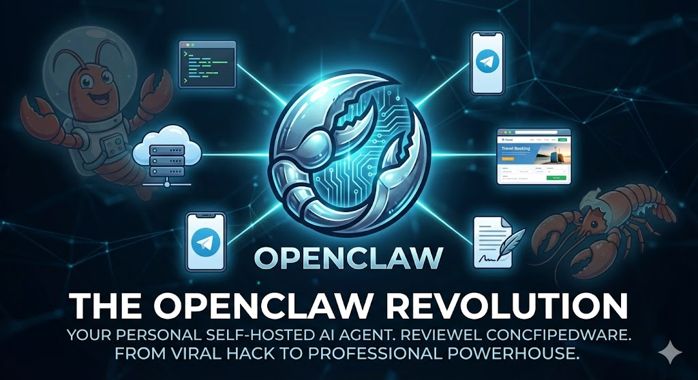
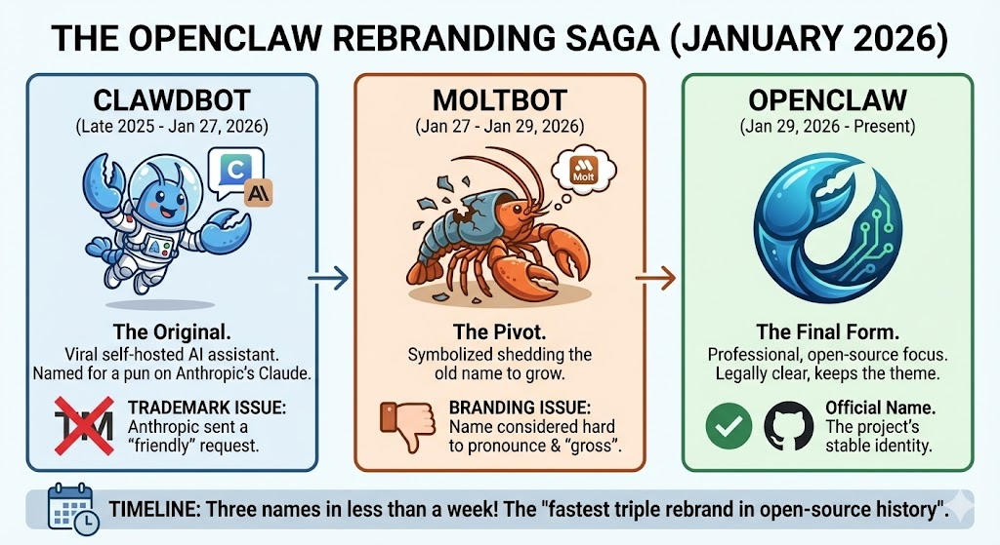

### **Introduction: The Death of the Chatbot**

For the past three years, we have been living in the era of the "Chatbot." We’ve grown accustomed to the routine: open a browser tab, log in to ChatGPT or Claude, type a prompt, and wait for a reply. It’s brilliant, yes—but it’s also remarkably passive. These models are "brains in a jar." They are disconnected from our files, our schedules, and our real-world workflows. When you close the tab, they essentially cease to exist. They have no "hands" to click buttons for you, and they have no "memory" of who you are once the context window flushes.

But in late January 2026, the jar broke.

A project emerged that didn't want to just talk; it wanted to *do*. It wanted to live on your server, read your emails, manage your calendar, and execute code in your terminal. It was a project that went through a wild identity crisis, a high-stakes rebranding saga, and a viral explosion that briefly made Mac Minis the most sought-after hardware on the planet.



Whether you call it **Clawdbot**, **Moltbot**, or its final, stable form, **OpenClaw**, you are looking at the future of human-AI collaboration. This is not just a tool; it's a teammate. This guide is your roadmap to deploying, securing, and mastering the most powerful open-source agent in existence.

* * *

## Part 1: The "Crustacean Identity Crisis" (The History)

To understand OpenClaw, you have to understand the five days that shook the AI world. It’s a story of rapid-fire innovation, trademark law, and the power of a "vibe check."

### Phase 1: The Clawdbot Era (The Viral Spark)

It started as a weekend hack by Austrian developer Peter Steinberger. He wanted a way to give Anthropic’s *Claude* a "body"—a way to interact with it via Telegram and let it run commands on his local machine. He called it **Clawdbot**.

The logo featured a friendly blue lobster in a spacesuit. It was a hit. Within 48 hours, it was the #1 trending repository on GitHub. Developers realized that Clawdbot wasn't just another wrapper; it was a runtime that could actually *act*.

### Phase 2: The Moltbot Pivot (The Legal Reality)

With 100,000 stars on GitHub comes the legal department. Anthropic sent a polite but firm request: "Clawdbot" was phonetically too close to "Claude."

Steinberger pivoted instantly to **Moltbot**. The concept was brilliant: a lobster "molts" its shell to grow bigger, symbolizing the project’s evolution. But the community "vibe check" failed. People found the word "molt" visceral and hard to pronounce. It lacked the professional polish needed for a tool that developers were starting to trust with their terminal access.

### Phase 3: OpenClaw (The Final Form)

On January 29, 2026, the project found its forever home: **OpenClaw**.

-   **Open:** Because it belongs to the community.
-   **Claw:** Because it keeps the "hands-on" power that made it famous.

The lobster mascot, now affectionately named **Molty**, remains the face of the project, but the infrastructure is now a professional-grade agentic runtime.

* * *

## Part 2: The Anatomy of an Agent (How it Works)

Why can OpenClaw do things ChatGPT can't? It comes down to four core pillars of "Agentic Design."

### 1\. Persistent Memory (The "Diary")

Standard AI has "Short-Term Memory" (the current conversation). OpenClaw has "Long-Term Memory." Every time you talk to it, it saves the interaction in local Markdown files on your server. Before it replies to your next message, it "reads" your history to understand your preferences, your current projects, and your past mistakes. It builds a personality over time.

### 2\. The Model Context Protocol (MCP)

This is the "nervous system" of the agent. MCP allows the AI brain (Claude or GPT) to communicate with "tools." When you say, "Search my files for the API key," the AI doesn't just guess. It sends a specific command to the OpenClaw runtime, which physically searches your hard drive and reports back.

### 3\. Proactive "Heartbeats"

OpenClaw has a "Heartbeat" feature. Every 30 minutes, it "wakes up," checks its environment, and sees if there’s anything it needs to tell you. It can monitor your inbox, watch for price drops on a website, or alert you if your server’s disk space is low—all without you prompting it first.

### 4\. "OpenCrawl": The Web Navigation Engine

This is the feature that sets the project apart. OpenClaw uses a built-in crawling engine (often called **OpenCrawl**) to navigate the web like a human. It launches a headless browser, bypasses simple bot detections, and can perform multi-step research tasks that would take a human hours. It doesn't just "search" the web; it *uses* it.

* * *

## Part 3: The Economics of Autonomy (What Does it Cost?)

Let's be real: running an autonomous agent is a luxury. While the OpenClaw software is free and open-source, the "fuel" (API tokens) is not.

Because OpenClaw sends huge amounts of "Memory" context with every message, it burns tokens much faster than a standard chatbot. Furthermore, it is *proactive*. If you enable the "Heartbeat," it wakes up every 30 minutes to check your tools.

| Usage Tier | Monthly Cost (API) | Best Use Case |
| --- | --- | --- |
| **The Hobbyist** | **$10 - $20** | Simple status checks, occasional coding help. |
| **The Power User** | **$50 - $100** | Managing daily emails, complex coding projects. |
| **The "Always-On" Agent** | **$300+** | Proactive research, 24/7 web monitoring. |

**Pro Tip:** Use **Gemini 1.5 Flash** for the "Heartbeat" tasks (it's incredibly cheap) and only switch to **Claude 3.5 Sonnet** when you need the "Big Brain" for coding or writing.

* * *

## Part 4: The Masterclass Installation Guide

Ready to build? We will follow the **Ubuntu VPS** path. This is the gold standard for anyone who wants an "always-on" agent that doesn't die when you close your laptop.

### 1\. The Hardware: Don't Skimp on RAM

You might be tempted to use a $5/month "Micro" server. **Don't.** OpenClaw is a beast. If you want it to browse the web or run multiple agents, you need memory.

-   **Minimum:** 2GB RAM / 1 vCPU.
-   **Recommended:** 4GB RAM / 2 vCPUs (DigitalOcean’s $24/mo Droplet is the sweet spot).

### 2\. The "One-Command" Install

SSH into your server. We’re going to use the universal installer script. It’s been hardened since the rebranding and handles Node.js v22 and all the Linux dependencies automatically.

```bash
curl -fsSL https://openclaw.ai/install.sh | bash
```

### 3\. The Onboarding Wizard

Once the installer finishes, it’s time to give your bot a soul. Run:

```bash
openclaw onboard --install-daemon
```

-   **Mode:** Choose **"QuickStart."**
-   **The Brain:** Choose **Anthropic** (Claude 3.5 Sonnet is currently the smartest "worker"). You’ll need to paste your API key here.
-   **The Voice:** Choose **Telegram**. It is the most reliable way to stay in touch with your bot on your phone.

### 4\. Setting up Telegram (The "Body")

To talk to your bot, you need a Telegram "dummy" account.

1.  Open Telegram and find **@BotFather**.
2.  Type `/newbot` and follow the prompts to get your **HTTP API Token**.
3.  Paste that token into your VPS terminal.
4.  Find your bot on Telegram, hit **Start**, and it will give you a **6-digit pairing code**.
5.  In your terminal, approve it: `openclaw pairing approve telegram [YOUR_CODE]`.

* * *

## Part 5: Security: Keeping the Space Lobster in Check

Giving an AI access to your terminal is like giving a toddler a chainsaw. It’s incredibly useful, but dangerous if unmonitored.

### The "Lethal Trifecta"

Security experts warn about three risks:

1.  **Privileged Access:** The bot can run `sudo` commands if you aren't careful.
2.  **Untrusted Data:** If the bot reads a malicious email, that email could contain "hidden instructions" telling the bot to delete your files.
3.  **No "Human in the Loop":** If the bot acts while you sleep, it could make a massive mistake.

### Best Practices:

-   **Never run as Root:** Always run the bot as a standard user.
-   **Use Tailscale:** Don't open your dashboard port (18789) to the public internet. Use a private mesh network like Tailscale to access it securely.
-   **Audit the Logs:** Every few days, peek into the `~/.openclaw/agents/` folder and read the Markdown files. It’s the only way to see if your bot is "hallucinating" or being manipulated.

* * *

## Conclusion: Living in the Agentic Future

Installing OpenClaw is more than just a technical project; it’s a shift in how you work. You are no longer alone in your digital workspace. You have a partner that knows your projects, monitors your interests, and "has your back" 24/7.

The transition from Clawdbot to OpenClaw was a "molting" process—painful, chaotic, and necessary. But the result is a tool that finally delivers on the promise of a personal AI assistant.

Start small. Set a $20 budget. Give it a few tasks. And before you know it, you won't remember how you ever managed your digital life without your Space Lobster.
