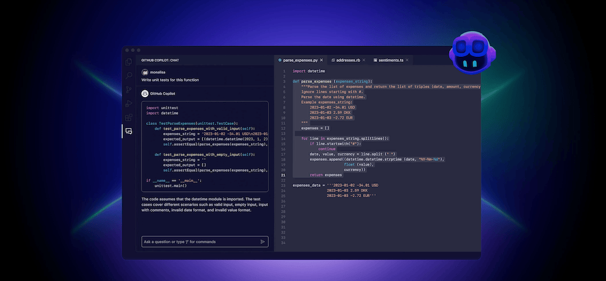

## **Introduction to AI in Coding**

AI is revolutionizing software development by automating repetitive tasks, suggesting improvements, and generating code snippets. AI coding assistants help developers enhance productivity, reduce errors, and stay updated with best practices. These tools leverage machine learning and natural language processing to provide contextual recommendations, making coding more efficient and enjoyable.

### 1\. [GitHub Copilot](https://github.com/features/copilot "GitHub Copilot")

GitHub Copilot is a popular AI-powered coding assistant developed by GitHub in collaboration with OpenAI. It leverages the GPT-3 model to provide developers with real-time code suggestions and completions right within their code editor. This tool is designed to assist developers by offering context-aware code snippets, reducing the amount of manual coding required and enhancing productivity.

## Key Features:

-   **Real-Time Code Suggestions**: GitHub Copilot offers real-time code suggestions as developers type, making it easy to find and insert relevant code snippets.
-   **Multi-Language Support**: Supports a wide range of programming languages, including Python, JavaScript, TypeScript, Ruby, and Go, among others.
-   **Context-Aware Completions**: Provides intelligent code completions based on the context of the code being written, improving accuracy and relevance.
-   **Integration with Popular Editors**: Seamlessly integrates with popular code editors like Visual Studio Code, enabling developers to use it within their existing workflows.

## Pros:

-   **Enhanced Productivity**: By offering code suggestions and completions, GitHub Copilot can significantly speed up the coding process and reduce manual effort.
-   **Learning Aid**: It can serve as a valuable learning tool for new developers by providing code examples and best practices.
-   **Broad Language Support**: Supports a wide range of programming languages, making it versatile for various development projects.

## Cons:

-   **Potential for Inaccurate Suggestions**: While highly effective, GitHub Copilot may occasionally provide incorrect or irrelevant suggestions, requiring developers to verify the code.
-   **Dependency on the Tool**: Overreliance on AI-generated code might hinder the development of coding skills for some developers.

## Ideal Use Cases:

-   **Boilerplate Code Generation**: Efficiently generates boilerplate code for repetitive tasks, saving time and effort.
-   **Code Exploration and Learning**: Assists developers in exploring new libraries and frameworks by providing code examples and usage patterns.
-   **Rapid Prototyping**: Facilitates rapid prototyping by quickly generating functional code snippets.

### 2\. [TabNine](https://www.tabnine.com/ "TabNine")

-   **Features and Integrations**: TabNine uses deep learning to predict and complete code. It supports multiple languages and integrates with popular IDEs like VS Code, IntelliJ, and Sublime Text.
-   **Customization Options**: Users can customize TabNine’s behavior to fit their coding style and project requirements.
-   **Integration with Popular IDEs**: TabNine integrates effortlessly with major IDEs, enhancing productivity with accurate and fast code predictions.

TabNine is an AI-powered code completion tool that uses deep learning models to provide intelligent code predictions and completions. It aims to enhance developer productivity by offering context-aware suggestions based on the code being written.

## Key Features:

-   **Deep Learning Code Completions**: Utilizes advanced deep learning models to predict and complete code with high accuracy.
-   **Multi-Language Support**: Supports a wide range of programming languages, making it versatile for various development environments.
-   **Customizable Suggestions**: Allows developers to customize the behavior and preferences of the AI to better fit their coding style and project requirements.
-   **IDE Integration**: Integrates seamlessly with popular integrated development environments (IDEs) such as Visual Studio Code, IntelliJ IDEA, and Sublime Text.

## Pros:

-   **High Accuracy**: Provides accurate and relevant code completions based on the context of the code being written.
-   **Versatile Language Support**: Supports multiple programming languages, making it suitable for diverse development projects.
-   **Customizability**: Allows developers to fine-tune the AI’s behavior to align with their specific needs and preferences.

## Cons:

-   **Resource Intensive**: The deep learning models used by TabNine can be resource-intensive, potentially impacting the performance of the development environment.
-   **Subscription Cost**: While a free version is available, the full features of TabNine require a subscription, which may be a consideration for some developers.

## Ideal Use Cases:

-   **Complex Codebases**: Particularly useful for large and complex codebases where accurate code completions can significantly speed up development.
-   **Learning and Exploration**: Helps developers explore new programming languages and frameworks by providing code examples and suggestions.
-   **Productivity Enhancement**: Boosts productivity by reducing the amount of manual coding required for repetitive tasks.

### 3\. [IntelliCode by Microsoft](https://visualstudio.microsoft.com/services/intellicode/ "IntelliCode by Microsoft")

-   **Features and Integrations**: IntelliCode enhances IntelliSense in Visual Studio and Visual Studio Code with AI-driven recommendations based on best coding practices from thousands of open-source projects.
-   **Contextual Recommendations**: It provides context-aware suggestions, making your code more robust and aligned with industry standards.
-   **Integration with Visual Studio**: Deep integration with Visual Studio ensures a smooth coding experience with intelligent insights.

Microsoft’s IntelliCode is an AI-powered extension for Visual Studio and Visual Studio Code that enhances the IntelliSense feature with context-aware code suggestions. It aims to improve developer productivity by providing intelligent recommendations based on patterns learned from analyzing thousands of open-source projects.

## Key Features:

-   **AI-Enhanced IntelliSense**: Provides intelligent code completions and suggestions based on context and coding patterns.
-   **Custom Models**: Allows developers to train custom models on their codebases, enhancing the relevance of suggestions.
-   **Refactoring Recommendations**: Offers suggestions for code refactoring to improve code quality and maintainability.
-   **Multi-Language Support**: Supports a variety of programming languages, including C#, C++, JavaScript, TypeScript, and Python.

## Pros:

-   **Improved Code Quality**: Provides recommendations based on best practices, helping developers write cleaner and more maintainable code.
-   **Customization**: Custom models can be trained on specific codebases, providing highly relevant suggestions tailored to the project.
-   **Seamless Integration**: Integrates seamlessly with Visual Studio and Visual Studio Code, enhancing the existing IntelliSense feature.

## Cons:

-   Limited to Microsoft Ecosystem: Primarily designed for use with Microsoft’s development environments, limiting its accessibility for developers using other IDEs.
-   Dependency on Training Data: The quality of custom model suggestions depends on the quality and consistency of the training data.

## Ideal Use Cases:

-   **Enterprise Development**: Ideal for enterprise development environments where code quality and maintainability are critical.
-   **Refactoring and Code Improvement**: Assists in refactoring and improving existing codebases by providing context-aware suggestions.
-   **Multi-Language Projects**: Supports a variety of programming languages, making it suitable for projects involving multiple languages.

### 4\. [Replit AI](https://replit.com/ai "Replit AI]")

Features and Integrations: Replit AI offers an AI-powered coding environment that supports real-time collaboration, code generation, and multi-language support.  
Collaboration Features: Ideal for team projects, Replit AI allows multiple users to code together, leveraging AI to suggest improvements and catch errors.  
Suitable for Various Programming Languages: Supports a wide range of languages, making it versatile for different projects.

Replit AI is an AI-powered coding assistant integrated into the Replit platform, which provides an online coding environment with real-time collaboration features. It aims to streamline the development process by offering intelligent code suggestions and facilitating teamwork.

## Key Features:

-   **Real-Time Code Generation**: Provides AI-driven code suggestions and completions as developers type, enhancing productivity.
-   **Collaborative Coding**: Supports real-time collaboration, allowing multiple developers to work on the same codebase simultaneously.
-   **Multi-Language Support**: Supports a variety of programming languages, making it suitable for different types of projects.
-   **Integrated Development Environment**: Offers a fully integrated online coding environment with built-in tools for debugging and testing.

## Pros:

-   **Enhanced Collaboration**: Facilitates teamwork by allowing multiple developers to work together in real-time, with AI assistance to improve code quality.
-   **Versatile Language Support**: Supports a wide range of programming languages, making it adaptable to various development needs.
-   **Online Accessibility**: As an online platform, Replit AI can be accessed from anywhere, making it convenient for remote teams.

## Cons:

-   **Internet Dependency**: Requires a stable internet connection for optimal performance, which might be a limitation in certain scenarios.
-   **Limited to Replit Platform**: The AI features are integrated into the Replit platform, which may not be suitable for developers using other IDEs.

## Ideal Use Cases:

-   **Team Projects**: Ideal for projects involving multiple developers, as it supports real-time collaboration and code sharing.
-   **Educational Settings**: Useful in educational settings for teaching coding and facilitating collaborative learning.
-   **Remote Development**: Suitable for remote development teams looking for an online platform with AI assistance.

### 5\. [Aider](https://github.com/paul-gauthier/aider "Aider")

Features and Integrations: Aider provides intelligent code completions and real-time collaboration features, integrating with popular development environments.  
Code Suggestions and Completions: It enhances productivity by suggesting relevant code snippets and completions based on context.  
Real-Time Collaboration Features: Supports team coding with real-time updates and shared coding sessions.

Aider is an AI-driven coding assistant designed to enhance developer productivity by providing intelligent code suggestions and facilitating collaboration. It integrates seamlessly with various development environments to offer a streamlined coding experience.

## Key Features:

-   **Contextual Code Completions**: Provides relevant code completions based on the current context, reducing manual coding effort.
-   **Real-Time Collaboration**: Enables multiple developers to work on the same codebase simultaneously, with real-time updates.
-   **Integration with Popular IDEs**: Works with a variety of integrated development environments, making it adaptable to different workflows.

## Pros:

-   **Enhanced Team Collaboration**: Supports real-time collaboration, making it ideal for team projects.
-   **Context-Aware Suggestions**: Provides intelligent code completions that help maintain coding standards and best practices.
-   **Versatile Integration**: Compatible with multiple IDEs, allowing developers to use it within their preferred environment.

## Cons:

-   **Potential for Over-Reliance**: Developers might become too dependent on AI suggestions, potentially impacting their coding skills.
-   **Subscription Cost**: Full access to Aider’s features may require a subscription, which could be a consideration for some developers.

## Ideal Use Cases:

-   **Team Projects**: Ideal for projects involving multiple developers, facilitating seamless collaboration.
-   **Productivity Enhancement**: Helps speed up the coding process by providing quick and relevant code suggestions.
-   **Maintaining Code Quality**: Ensures code quality and consistency through context-aware suggestions.

### 6\. [Ponicode](https://circleci.com/ "Ponicode")

Features and Integrations: Ponicode generates unit tests and improves code quality with AI-driven suggestions.  
Unit Test Generation with AI: Automatically creates unit tests, ensuring higher code coverage and reliability.  
Code Quality Improvements: Helps maintain high standards by suggesting improvements and catching potential issues.

Ponicode is an AI-powered tool focused on improving code quality by generating unit tests and offering code insights. It helps developers ensure robust and reliable code through automated testing and AI-driven suggestions.

## Key Features:

-   **Automated Unit Test Generation**: Generates unit tests automatically, ensuring comprehensive code coverage and reliability.
-   **Code Quality Insights**: Provides suggestions to improve code quality and catch potential issues before they become problems.
-   **Integration with CI/CD Pipelines**: Integrates with popular CI/CD pipelines, facilitating continuous testing and integration.

## Pros:

-   **Enhanced Code Quality**: Ensures high code quality through automated unit tests and AI-driven suggestions.
-   **Time-Saving**: Saves developers time by automating the creation of unit tests and providing quick insights.
-   **Continuous Integration Support**: Integrates with CI/CD pipelines, supporting continuous testing and integration.

## Cons:

-   **Learning Curve**: May require some time for developers to fully understand and utilize its features.
-   **Subscription Cost**: Full access to Ponicode’s features may require a subscription.

Ideal Use Cases:

-   **Test-Driven Development**: Ideal for projects following test-driven development practices, ensuring comprehensive unit test coverage.
-   **Code Quality Assurance**: Helps maintain high code quality through automated testing and suggestions.
-   **Continuous Integration**: Supports continuous integration and testing, making it suitable for modern development workflows.

### 7\. [MarsCode](https://www.marscode.com/ "MarsCode")

Features and Integrations: MarsCode assists in writing and debugging code with AI, supporting multiple programming languages.  
AI-Assisted Code Writing and Debugging: Offers intelligent suggestions and debugging help, making coding more efficient.  
Support for Multiple Programming Languages: Suitable for various projects with its broad language support.

MarsCode is an AI-powered coding assistant designed to assist developers in writing and debugging code. It supports multiple programming languages and provides intelligent suggestions to enhance productivity.

## Key Features:

-   **Intelligent Code Suggestions**: Provides context-aware code suggestions to help developers write code more efficiently.
-   **AI-Assisted Debugging**: Offers debugging assistance by identifying and suggesting fixes for potential issues in the code.
-   **Multi-Language Support**: Supports a wide range of programming languages, making it versatile for different types of projects.

## Pros:

-   **Enhanced Productivity**: Helps developers write and debug code more efficiently, reducing manual effort.
-   **Versatile Language Support**: Supports multiple programming languages, making it suitable for various projects.
-   **Intelligent Debugging**: Provides AI-assisted debugging to identify and fix issues quickly.

## Cons:

-   **Potential for Inaccurate Suggestions**: While generally effective, AI-generated suggestions may occasionally be inaccurate or irrelevant.
-   **Subscription Cost**: Full access to MarsCode’s features may require a subscription.

## Ideal Use Cases:

-   **Debugging and Error Fixing**: Ideal for projects that require extensive debugging and error fixing, as it provides intelligent assistance.
-   **Multi-Language Projects**: Suitable for projects involving multiple programming languages, offering versatile support.
-   **Productivity Enhancement**: Enhances productivity by providing quick and relevant code suggestions.

## 8\. [Amazon Q](https://aws.amazon.com/q/ "Amazon Q")

Features and Integrations: Amazon Q is a generative AI-powered assistant that helps with code generation, testing, debugging, and planning. It integrates with enterprise data repositories to provide contextually relevant suggestions.  
Code Generation, Testing, Debugging, and Planning: Streamlines the development process with comprehensive AI support.  
Integration with Enterprise Data Repositories: Leverages existing data to provide accurate and relevant coding assistance.

Amazon Q is an AI-powered assistant developed by Amazon, designed to assist developers in various aspects of the software development lifecycle. It offers code generation, testing, debugging, and planning capabilities, integrating with enterprise data repositories for contextually relevant suggestions.

## Key Features:

-   **Comprehensive AI Assistance**: Provides support for code generation, testing, debugging, and planning, streamlining the development process.
-   **Enterprise Data Integration**: Integrates with enterprise data repositories, offering contextually relevant suggestions based on existing data.
-   **Generative AI**: Utilizes generative AI to provide intelligent code completions and suggestions, enhancing developer productivity.

## Pros:

-   **Versatile Support**: Offers comprehensive support across different stages of the development lifecycle, enhancing productivity.
-   **Contextually Relevant Suggestions**: Leverages enterprise data to provide accurate and relevant coding assistance.
-   **Generative AI Capabilities**: Utilizes generative AI to offer intelligent and context-aware code suggestions.

## Cons:

-   **Enterprise Focus**: Primarily designed for enterprise environments, which may limit its accessibility for individual developers or small teams.
-   **Subscription Cost**: Full access to Amazon Q’s features may require a subscription, which could be a consideration for some users.

## Ideal Use Cases:

-   **Enterprise Development**: Ideal for enterprise development environments that require comprehensive AI support and integration with existing data repositories.
-   **Comprehensive Development Assistance**: Suitable for projects that require support across various stages of the development lifecycle, including code generation, testing, debugging, and planning.
-   **Productivity Enhancement**: Enhances productivity by providing intelligent and contextually relevant code suggestions.

### 9\. [Continue AI](https://www.continue.dev/ "Contginue AI")

Features and Integrations: Continue AI provides AI-driven code completion and suggestions, integrating with multiple IDEs.  
Context-Aware Coding Assistance: Offers intelligent, context-aware suggestions to enhance coding efficiency.  
Integration with Multiple IDEs: Compatible with various development environments, making it a versatile tool for developers.

Continue AI is an advanced AI-powered coding assistant designed to provide context-aware code completions and suggestions, enhancing the efficiency and quality of software development. It integrates with various IDEs, offering developers seamless assistance across different programming languages and projects.

## Key Features:

-   **Context-Aware Code Completions**: Provides intelligent code completions based on the current context, helping developers write efficient and accurate code.
-   **Multi-Language Support**: Supports a wide range of programming languages, making it suitable for diverse development environments.
-   **Seamless IDE Integratio**n: Integrates smoothly with popular integrated development environments such as Visual Studio Code, IntelliJ IDEA, and more.

## Pros:

-   **Enhanced Coding Efficiency**: Offers real-time, context-aware code suggestions, reducing the time and effort required for manual coding.
-   **Versatile Language Support**: Supports multiple programming languages, making it adaptable to various projects and development needs.
-   **Seamless Integration**: Easily integrates with various IDEs, providing a consistent and intuitive coding experience.

## Cons:

-   **Potential Over-Reliance**: Developers might become overly dependent on AI suggestions, which could impact their coding skills and problem-solving abilities.
-   **Subscription Cost**: Full access to Continue AI’s features may require a subscription, which could be a consideration for some developers.

## Ideal Use Cases:

-   **Multi-Language Projects**: Suitable for projects involving multiple programming languages, offering versatile support and intelligent code suggestions.
-   **Productivity Enhancement**: Ideal for developers looking to enhance their productivity and coding efficiency through intelligent, context-aware assistance.
-   **Learning and Exploration:** Helps developers explore new languages and frameworks by providing relevant code examples and suggestions.

## How to Choose the Right AI Coding Assistant

**Factors to Consider**: When selecting an AI coding assistant, consider the following factors to find the best fit for your needs:

-   **Project Type**: Determine the nature and complexity of your project to choose an AI tool that offers the necessary support and features.
-   **Language Support**: Ensure the AI assistant supports the programming languages you use in your development projects.
-   **Integration Needs**: Look for seamless integration with your preferred integrated development environment (IDE) and other tools you use.
-   **Cost and Budget**: Consider the cost of the AI assistant, including subscription fees, and evaluate it against your budget and the value it provides.
-   **Customization and Flexibility**: Choose an AI tool that allows customization and flexibility to adapt to your specific coding style and requirements.
-   **User Reviews and Feedback**: Research user reviews and feedback to understand the experiences of other developers and the tool’s performance in real-world scenarios.

### Conclusion

AI coding assistants can significantly boost productivity and code quality by providing intelligent suggestions, code completions, and real-time collaboration features. By leveraging the features and integrations of these top AI coding assistants, developers can streamline their workflows, reduce errors, and focus on more creative aspects of coding. Try out different tools to find the one that best suits your needs and enhances your coding experience.
