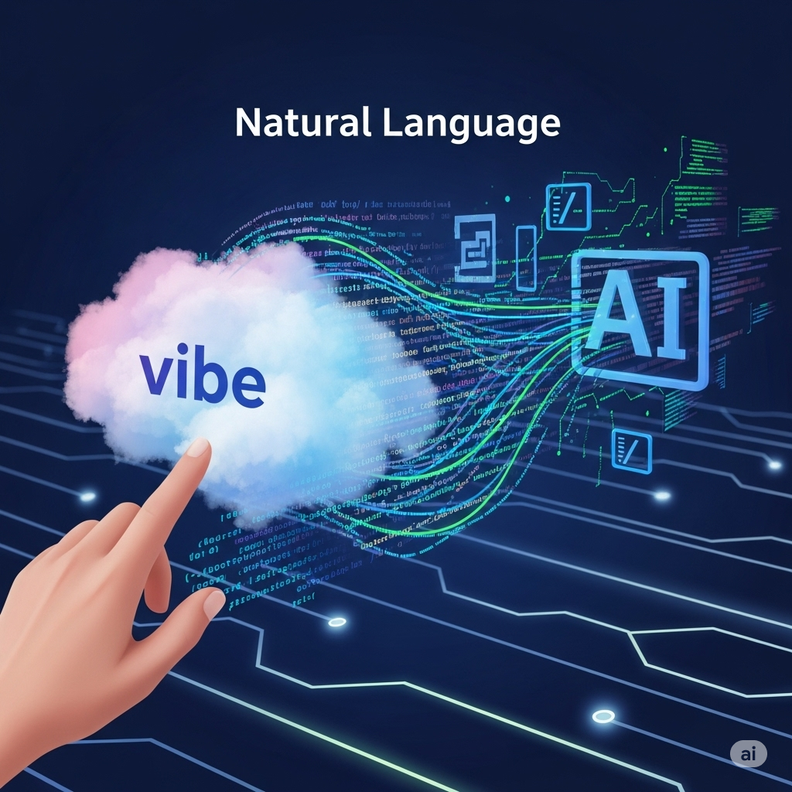
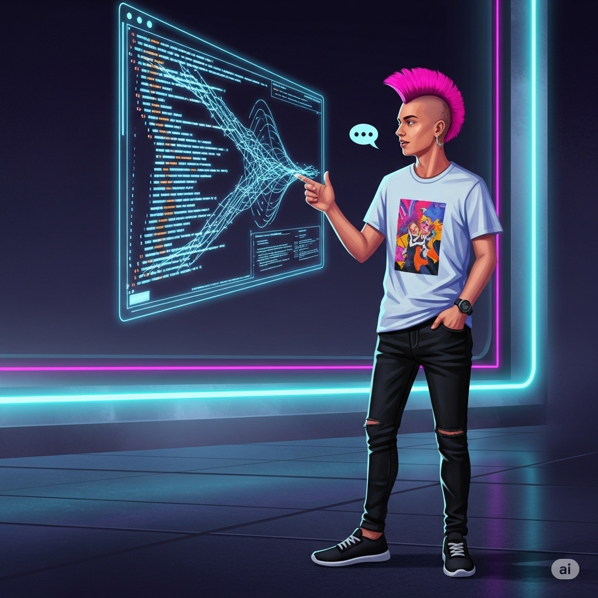
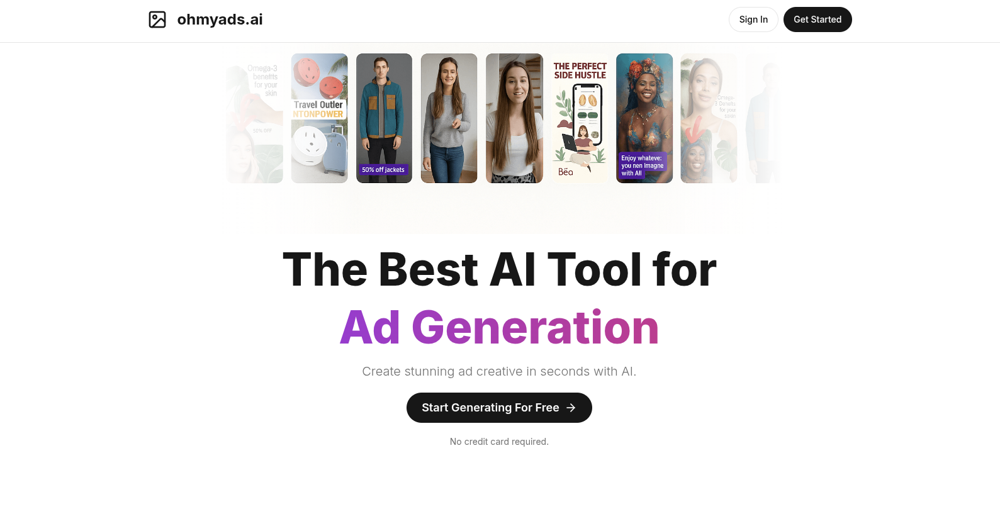

In the ever-evolving landscape of software development, a revolutionary approach is taking hold, promising to democratize coding and accelerate innovation: **Vibe Coding**. Coined by renowned AI researcher Andrej Karpathy in early 2025, this method moves beyond traditional syntax and complex programming languages, embracing natural language as the primary interface for building software.

But what exactly is vibe coding, and why is there such a buzz around it? Let's dive in.

### What is Vibe Coding and What's the Hype?

At its core, vibe coding is about expressing your intent and desired functionality in plain language, then letting an AI tool translate that "vibe" into executable code. Imagine telling a sophisticated assistant, "Create a simple web application with a login page, a dashboard showing user data, and a way to upload files," and watching it generate the necessary code, structure, and even deployment steps.

The hype surrounding vibe coding stems from several key benefits:

**Accessibility:** It significantly lowers the barrier to entry for software development. Individuals with brilliant ideas but limited coding experience can now bring their visions to life.

**Speed and Efficiency:** By automating repetitive and boilerplate coding tasks, vibe coding drastically reduces development time, allowing developers to focus on higher-level problem-solving and creative aspects.

**Iterative Development:** Vibe coding thrives on a "code first, refine later" approach. You can quickly generate a basic version, test it, provide feedback in natural language, and the AI refines the code iteratively until it meets your expectations. This aligns perfectly with agile methodologies.

**Focus on Intent:** Instead of getting bogged down in syntax and implementation details, developers can concentrate on *what* they want the software to do, leading to more intuitive and user-centric designs.

Vibe coding is not just a theoretical concept; it's actively being adopted by startups and experienced developers alike to build and launch AI-powered applications at an unprecedented pace.

### The Evolution of Development: From Manual to Conversational

**Have you ever felt limited by your coding skills when trying to bring an idea to life? Share your experiences in the comments below!**

### Tools Revolutionizing Vibe Coding

The rise of vibe coding has given birth to a new generation of powerful AI-powered tools and integrated development environments (IDEs). Here are some of the prominent players currently shaping the vibe coding landscape:

-   **Lovable.ai:** Positioned as a tool for "non-technical builders," Lovable.ai excels at conversational coding, enabling users to create fully functional web applications by simply chatting with the AI. It handles features like user authentication, search functionality, and interactive elements, turning natural language prompts into production-ready code.

> Okay, lovable is insane
> 
> I made this landing page with just a few prompts
> 
> Super good at generating unique-looking designs, turn screenshots to code and edit with tailwind. This is a designer's dream. [pic.twitter.com/Y9tShS9D2D](https://t.co/Y9tShS9D2D)
> 
> — Meng To (@MengTo) [March 18, 2025](https://twitter.com/MengTo/status/1901812553803837858?ref_src=twsrc%5Etfw)

-   **Bolt.new:** Ideal for rapid prototyping, Bolt.new allows users to create, edit, and deploy web and mobile applications directly in their browser. Leveraging technologies like StackBlitz's WebContainers, it simplifies the development of full-stack applications without requiring any local software installation.  
    **Try it out yourself!** Head over to [Bolt.new](https://bolt.new) and see how quickly you can spin up a basic webpage using just a few descriptive sentences.
    
-   **Cursor (as an IDE):** Cursor stands out as an AI-first code editor designed for deep integration with AI. Unlike traditional IDEs that might use AI as a plugin, Cursor weaves AI into every layer of the development experience. It offers context-aware autocomplete, natural language refactoring, terminal command generation, and a built-in AI chat that understands your entire project, enabling multi-file edits and deeper contextual help. It's like having an AI pair programmer constantly at your side.
    

### **My Experience with Cursor: Building ohmyads.ai**

I recently utilized Cursor's powerful AI capabilities to build [ohmyads.ai](https://ohmyads.ai). This project showcases how natural language prompts and iterative feedback within Cursor can accelerate development significantly. From initial concept to a functional web service, the process felt less like traditional coding and more like a collaborative conversation with an incredibly intelligent assistant. Cursor's ability to understand context across multiple files and suggest complex refactorings based on my high-level "vibe" was instrumental in bringing ohmyads.ai to life efficiently.

**Other Notable Tools:** While Lovable, Bolt.new, and Cursor are leading the charge, other tools like v0 by Vercel (for UI prototyping), GitHub Copilot (for advanced code autocompletion), and Replit (for collaborative AI-powered coding) also play significant roles in the vibe coding ecosystem.

These tools are not just generating code; they are automating workflows, providing instant deployment, and making the entire development process more intuitive and less cumbersome.

### How to Get Started with Vibe Coding

Ready to embrace the future of coding? Here's a step-by-step guide to get you started with vibe coding:

1.  **Choose Your Weapon (Tool):** The first and most crucial step is selecting an AI coding tool that aligns with your needs and comfort level. If you're a complete beginner, Lovable.ai or Bolt.new might be excellent starting points due to their conversational nature and focus on non-technical users. If you have some coding background and want a deeply integrated AI experience, Cursor is a powerful choice. Many tools offer free tiers or trials, so don't hesitate to experiment!
    
2.  **Start Small, Think Simple:** Resist the urge to build your next big app on your first try. Begin with ridiculously simple projects, akin to a "Hello World" application. For instance, instead of aiming for a full social media platform, try prompting for:
    
    -   "A simple HTML page with a heading 'Welcome to My App' and a button that says 'Click Me'."
    -   "A Python script that takes user input and prints 'Hello, \[user input\]!'"
3.  **Converse with the AI:** This is where the "vibe" comes in. Use natural language to describe what you want. Be clear and specific, but don't worry about perfect syntax or technical jargon.
    
    -   Instead of "Make a login form," try "Create a responsive login page with fields for username and password, a 'Remember Me' checkbox, and a 'Login' button. The background should be a subtle gradient."
4.  **Review, Run, and Refine:** The AI will generate code based on your prompt.
    
    -   **Review:** Take a moment to look at the generated code. Even if you're not a seasoned coder, you can often spot obvious issues or areas for improvement.
    -   **Run:** Most vibe coding tools offer instant previews or deployment. See your creation in action!
    -   **Refine:** This is an iterative process. If something isn't quite right, tell the AI. "Make the button green," "Add a forgot password link," or "Center the form on the page." The more specific your feedback, the better the AI can adjust.
5.  **Embrace the Iterative Loop:** Vibe coding is a continuous cycle of generating, executing, observing, providing feedback, and correcting. Don't expect perfection on the first try. The power lies in the rapid iteration and the AI's ability to learn from your natural language instructions.
    

**What's the first thing you'd try to build with a vibe coding tool? Let us know in the comments!**

Vibe coding is not just a trend; it's a fundamental shift in how we interact with code. By harnessing the power of AI and natural language, it's making software development more intuitive, accessible, and exciting for everyone. So, pick a tool, start typing (or speaking!), and get ready to vibe code your way to your next big idea!
