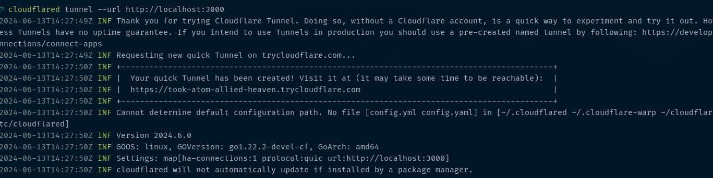

If you’re like me, constantly tinkering with webhooks, testing APIs, or showcasing projects to clients, you know the pain of exposing your localhost to the internet. Ngrok has been my go-to for years, but recently, its bandwidth limitations and incessant upgrade prompts have been driving me up the wall. Enter Cloudflared Tunnel—my new best friend. Let me tell you why I made the switch and why you might want to consider it too.

## Ngrok: A Love-Hate Relationship

Don’t get me wrong, Ngrok is a fantastic tool. It’s been a staple in my development toolkit for ages. But there’s a catch. After just a few days of heavy usage, I’d hit bandwidth limits and get those annoying upgrade prompts. As a developer working on data-intensive projects, this became a major bottleneck. It’s like being told to upgrade your pizza slice to a whole pie just because you’re hungry—every single time.

## Why Cloudflared Tunnel Rocks

-   Unlimited Bandwidth: Seriously, this is a game-changer. Cloudflared Tunnel doesn’t throttle your traffic. You get to develop, test, and demo your projects without ever worrying about hitting a limit. It’s like having an all-you-can-eat buffet with no hidden charges.
    
-   Integration with Cloudflare: If you’re already using Cloudflare for DNS, SSL, or security, adding Cloudflared Tunnel into the mix is seamless. You get top-notch DDoS protection, SSL encryption, and global content delivery out of the box. No extra configurations, no additional costs. Just pure, unadulterated efficiency.
    
-   Cost-Effective: Ngrok’s free tier is nice until it isn’t. The cost of upgrading can add up quickly. Cloudflared Tunnel offers a much more budget-friendly approach. With Cloudflare’s scalable solutions, you won’t get any nasty surprises on your bill.
    
-   No Login for Simple Local Testing: Here’s the kicker—Cloudflared doesn’t require you to log in if you’re just tunneling a simple localhost. This is perfect for quick tests, like setting up OAuth with Slack, which doesn’t play nicely with localhost callbacks. It’s as simple as running a single command, and you’re live.
    

### How to Get Started with Cloudflared Tunnel

Let’s get practical. Here’s how you can get up and running with Cloudflared Tunnel in no time:

Install Cloudflared: First, grab the Cloudflared tool from Cloudflare’s official site.

```
brew install cloudflared
```

Run a Tunnel Without Login: For basic testing, you don’t even need to log in. Just run:

```
cloudflared tunnel --url localhost:3000
```

Replace localhost:3000 with whatever port your local server is using.

Access Your Server: Boom! Your local server is now exposed to the internet. Use the provided URL to access it remotely.  


Ngrok served me well, but its limitations became a hassle. Cloudflared Tunnel offers a breath of fresh air with unlimited bandwidth, seamless integration with Cloudflare’s services, and a more developer-friendly approach. Plus, the ability to run simple tests without logging in is a huge bonus.

If you’re tired of hitting bandwidth caps and upgrade prompts, give Cloudflared Tunnel a try. It might just become your new favorite development tool.

> Feel free to share your thoughts, experiences, or any questions in the comments below. Happy coding!
