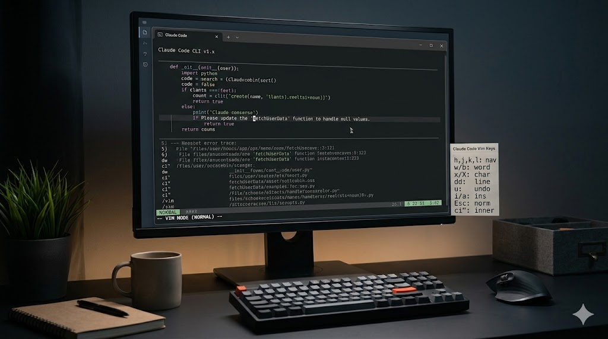

  
Welcome back to maxlibin.com. If you’ve been spending any time with Anthropic’s Claude Code CLI, you already know it is an incredible tool. Having an AI agent live directly in your terminal, capable of navigating your codebase, running tests, and executing commands, is a massive leap forward for developer productivity.

But I’m going to be completely honest with you: if you are still using standard text input to write and edit your prompts, you are leaving a massive amount of efficiency on the table.

~Right now, a huge portion of Claude Code users haven't touched the `/vim` toggle yet.~ use `/config` search for `Editor mode` use `tab` to switch to `vim`. Why? Because Vim has a reputation. To the uninitiated, it looks like an esoteric, arcane language reserved for greybeard sysadmins who refuse to use a mouse. The learning curve looks steep, and the fear of getting "trapped" in Vim is a long-standing developer joke.

But here is the reality: you don't need to master Vim to benefit from it. Learning just the absolute *basics* of Vim motions will fundamentally transform how you edit text. It eliminates the friction of moving your hands off the keyboard, effectively allowing you to edit prompts at the speed of thought.

Here is exactly why Claude Code’s Vim mode is so profoundly powerful, the basic keys you need to know, and why making the switch will upgrade your terminal workflow forever.

* * *

## The Bottleneck Between You and Your AI

When you use Claude Code, you are often writing multi-line, highly detailed prompts. You are pasting in errors, providing context, and structuring requests.

Think about what happens when you make a typo three lines up, or realize you need to change a specific variable name hidden in the middle of a paragraph. In standard editing mode, you have two choices:

1.  **The Arrow Key Crawl:** You hold down the up and left arrow keys, watching your cursor slowly inch its way across the screen until it reaches the destination.
2.  **The Mouse Reach:** You completely break your flow state, take your right hand off the keyboard, grab your mouse, click the exact character, and move your hand back to the keyboard.

Both of these methods create cognitive friction. The overhead of switching between writing code in an IDE and sluggishly navigating a terminal prompt breaks your focus. Vim mode solves this by keeping your hands firmly planted on the home row.

* * *

## What Exactly is Modal Editing?

To understand why Vim mode is powerful, you have to understand "modal editing." Standard text editors (like Microsoft Word or a basic terminal prompt) only have one mode: *Insert Mode*. When you press a key, that letter appears on the screen.

Vim operates on the philosophy that **you spend vastly more time navigating and editing text than you do writing it from scratch.** Therefore, it separates text manipulation from text input through two primary modes:

-   **Insert Mode:** Behaves exactly like what you are used to. You type, and text appears.
-   **Normal Mode:** This is where the magic happens. In Normal mode, your keys are no longer letters—they are actions. You press `Esc` to enter Normal mode. Now, pressing `w` doesn't type a "w"; it jumps your cursor forward by one word. Pressing `d` doesn't type a "d"; it acts as a command to delete.

By separating typing from editing, Vim turns your entire keyboard into a highly optimized control panel for text manipulation.

* * *

## How to Enable Vim Mode in Claude Code

Turning this feature on is wonderfully simple. Claude Code has built this directly into the CLI.

1.  Open your Claude Code terminal session.
2.  Type `/vim` and press **Enter**.

That’s it. You will see a message confirming: *Editor mode set to vim*.  
To switch back to standard input, you just type `/vim` again.

This setting is globally persistent. It saves to your `~/.claude.json` configuration file, meaning Vim mode will remain active the next time you boot up the CLI. By default, the prompt will open in **Insert Mode** so you can start typing your prompt immediately. The moment you need to edit what you've written, you just tap the `Esc` key to enter **Normal Mode**.

* * *

## The Essential Cheat Sheet: Keys You Actually Need

You do not need to memorize a textbook to be productive in Vim mode. If you learn just a handful of commands, you will already be faster than using a mouse.

### 1\. Home Row Navigation

Forget the arrow keys. In Normal mode, you move using your right hand on the home row:

-   **`h`** - Move left
-   **`j`** - Move down
-   **`k`** - Move up
-   **`l`** - Move right

### 2\. Jumping Around (Motions)

Moving character-by-character is for beginners. Vim lets you jump exactly where you need to go:

-   **`w`** - Jump forward to the start of the next word.
-   **`b`** - Jump backward to the start of the previous word.
-   **`0`** (zero) - Jump to the absolute beginning of the line.
-   **`$`** - Jump to the absolute end of the line.
-   **`gg`** - Jump to the very top of your multi-line prompt.
-   **`G`** - Jump to the very bottom of your prompt.

### 3\. Entering Insert Mode (The Right Way)

Getting back to typing text is context-dependent. Vim gives you surgical precision for *where* you want to start typing:

-   **`i`** - Insert *before* the cursor.
-   **`a`** - Append *after* the cursor.
-   **`A`** - Jump to the end of the line and insert (incredibly useful).
-   **`o`** - Open a brand new line *below* your current line and insert.
-   **`O`** - Open a brand new line *above* your current line and insert.

### 4\. Making Edits (Operators)

-   **`x`** - Delete the single character under your cursor.
-   **`u`** - Undo your last mistake.
-   **`dd`** - Delete the entire line you are currently on.

* * *

## The Grammar of Vim: Why It Feels Like Magic

If the keys above were all Vim had to offer, it would be neat, but not revolutionary. The true superpower of Vim is **composability**.

Vim operates like a language. It has verbs (actions) and nouns (text objects/motions). When you combine them, you can perform massive edits with just two or three keystrokes.

Here are the primary verbs:

-   **`d`** (delete)
-   **`c`** (change - which deletes the text and instantly puts you back into Insert mode)
-   **`y`** (yank/copy)

Now, let's combine them with motions (the nouns):

-   Want to delete a word? Press **`dw`** (delete + word).
-   Want to change a word? Press **`cw`** (change + word). It deletes the word and drops you into Insert mode so you can instantly type the replacement.
-   Want to delete to the end of the line? Press **`d$`** (delete + end of line).
-   Want to change everything inside a pair of quotes? Move your cursor inside the quotes and press **`ci"`** (change + inner + quotes). This immediately wipes out the string and lets you type a new one.

You can even add numbers to the grammar!

-   Want to delete three words? Press **`d3w`**.
-   Want to delete three entire lines? Press **`3dd`**.

Imagine you are drafting a prompt in Claude Code: *"Please update the 'fetchUserData' function to handle null values."* You realize you meant `fetchAdminData`. With standard editing, you'd use the mouse to highlight it, delete it, and retype it. In Vim mode, you press `Esc`, jump back to the word with `b`, press **`ci'`**, and immediately type *fetchAdminData*. It takes less than two seconds.

* * *

## Conclusion: A Skill For a Lifetime

Enabling Vim mode in Claude Code isn't just about making your AI prompts easier to write. It is an investment in your baseline computing speed.

The initial transition might feel clumsy for the first day or two. Your brain will instinctively reach for the arrow keys. But if you force yourself to keep your hands on the home row and rely on `h`, `j`, `k`, `l`, `w`, and `b`, muscle memory will take over faster than you expect.

Furthermore, the Vim keybindings you learn in Claude Code are universal. They work in terminal environments across the globe. You can use them to edit configuration files on remote Linux servers, you can enable Vim extensions in VS Code or Neovim, and you can even use browser plugins like Vimium to navigate the web without a mouse.

Stop wrestling with sluggish terminal inputs. Open Claude Code today, type `/vim`, and start editing your prompts at the speed of thought. Your wrists—and your future self—will thank you.
