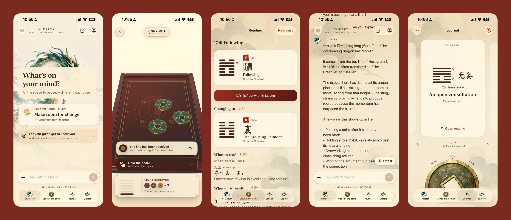

My new app, [Zhouyi Master AI](https://apps.apple.com/sg/app/zhouyi-master-ai/id6815581151), is now on the App Store.

It is an app for the I Ching (周易, the Zhouyi). You cast a hexagram, read what the classic text says, and use it to think through whatever is on your mind.

## Why I built it

I have been interested in the I Ching for a while and recently started learning it properly. It is not an easy book to get into. The texts are short and old, every line has layers of commentary, and one hexagram can lead you to five more.

AI turned out to be the best study partner I have found for this. I can ask what a line means, how it relates to the hexagram it changes into, or how different translators read it, and keep asking follow-up questions until it makes sense. So I built the app I wanted while learning: the classic texts, a proper way to cast, and a guide I can talk a reading through with.

I built it as a tool for reflection, not fortune-telling. The I Ching is useful because it slows you down and asks you to look at a situation from another angle. I wanted the app to keep that and leave out the mystical promises.

## What it does

- **Coin casting.** Flick your iPhone to toss three virtual coins onto a wooden board, or tap a button if you prefer. Six tosses build your hexagram and any changing lines.
- **The full library.** All 64 hexagrams, each with the traditional text, line-by-line readings and a short reflection. You can browse them or search by name, including pinyin without tone marks.
- **Learning tools.** Build a hexagram line by line, explore the eight trigrams and follow short lessons. The first hexagram includes illustrated stages of the dragon.
- **Yi Master, the AI guide.** A chat that helps you separate what is happening from what you fear, and work out what you can actually influence. It does not predict the future, and it does not give medical, legal or financial advice.
- **Daily practice and journal.** A short daily reflection, plus a journal that saves every reading so you can look back later.

## Private by default

There is no account, no ads and no trackers. Your readings, journal, conversations and profile stay on your device. The only thing that leaves it is the message you send to Yi Master.

## Pricing

Casting, reading and the journal are free. Each install also comes with some free Yi Master replies. If you want to talk with the guide regularly, the monthly subscription is S$6.98 for about 3,700 replies a month.

It runs on iPhone and iPad (iOS 18 or later), and on Apple silicon Macs and Vision Pro.

If you try it, I would love to hear what you think. [Download Zhouyi Master AI on the App Store](https://apps.apple.com/sg/app/zhouyi-master-ai/id6815581151).
